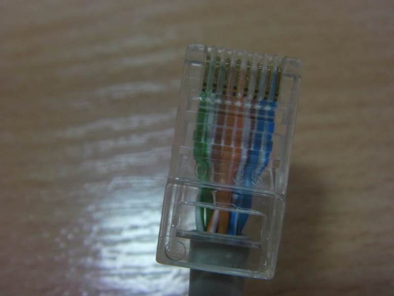

## Додаток 2.1. Робота стенду 1 (для віртуальної лабораторної установки).

#### Д.2.1.1. Підготовка кабелю К1.

Беремо SUB-D 9 пін типу розетка і розбираємо його. 

рис.Д1.

Паяємо до контактів провідники кабелю (К1) типу UTP cat5. Задіємо усі контакти роз’єму окрім RI, а отже і всі пари в кабелі UTP. Не використовувані провідники можна буде пізніше не підключати або обрізати. 

1 - коричновий (DCD) 

2 - біло-оранжевий (RxD)

3 - оранжевий (TxD)

4 - біло-коричновий (DTR)

5 - біло-синій (GND)

6 - зелений (DSR)

7 - синій (RTS)

8 - біло-зелений (CTS)

рис.Д2.

рис.Д3.

Одягаємо захисну кришку. 

рис.Д4

рис.Д5

З іншого боку в нас буде розпушений кінець

рис.Д6

#### Д.2.1.2. Підготовка кабелю К2.

У лабораторній установці в якості пристрою використовується ПЛК М340 CPU1000 з вбудованим послідовним каналом RS-232/RS-485 (роз’їм RJ45, маркується як "Modbus"). Зверніть увагу на те, що звичні для багатьох популярні RJ45 роз’єми використовуються не тільки для Ethernet.

рис.Д7.

Документація для послідовних інтерфейсів М340 доступна за посиланням. 

На сторінці 21 вказаної настанови є схема контактів послідовного порта

рис.Д8.

Ми задіємо усі контакти роз’єму для універсальності кабелю. Пізніше за необхідності ми зможемо використати ці контакти в інших роботах.  

Обжимаємо UTP-кабель спеціальним інструментом для обжимання розємів RJ45.

 

рис.Д9

У результаті отримаємо обжатий з одного боку UTP кабель (К2).

рис.Д10

рис.Д11

Підготуємо маркування для провідників кабелю з другого (необжатого) боку відповідно до їх призначення. 

рис.Д12

Одягаємо бірки з маркуванням на провідники відповідно до їх призначення. 

<https://www.youtube.com/watch?v=SYUMcKK2m1w&feature=player_embedded>

Підключаємо кабель К2 до клем. Чіпляємо клеми на DIN-рейку.

<https://www.youtube.com/watch?v=9PWZsRWrEbI&feature=player_embedded>

Результат видно на наступних фотографіях.

рис.Д13

рис.Д14

#### Д.2.1.3. Підключення пристрою до клемної колодки кабелем К2. Вимірювання опору приймача пристрою. 

Підключаємось кабелем К2 до вимкненого пристрою.

<https://www.youtube.com/watch?v=5y_a8QJ0Jxk&feature=player_embedded>

Перемкнувши тестер в режим вимірювання опору, визначаємо опір приймача між клемами RxD та SG. 

<https://www.youtube.com/watch?v=2EiX2ktDuOM&feature=player_embedded>

#### Д.2.1.4. Вимірювання опору приймача ПК.

При вимкненому живленні знаходимо на ПК СОМ-порт. Розробники комп’ютерів передбачили різні роз’єми для різних типів інтерфейсів. Тим не менше, COM-порт має таку саме форму як порт VGA (для підключення монітору) але відрізняється кількість контактів (у VGA їх 15-ть) і типом з’єднання (у VGA – розетка, а у СОМ-порта - вилка). У будь-якому випадку, при підключенні, Ви не зможете помилитися роз’ємом, тому що з’єднання різні. 

<https://www.youtube.com/watch?v=sd4fL57EuVk&feature=player_embedded>

Вимірюємо опір на роз’ємі СОМ-порта між 2-м та 5-тим контактом.

<https://www.youtube.com/watch?feature=player_embedded&v=wEAQSED8Lns>

#### Д.2.1.5. Під’єднання пристрою та ПК через нуль-модемне з'єднання.

На розпушеному кінці кабелю залишаємо тільки потрібні для з’єдання провідники.

Початковий вигляд вільного кінця кабелю:

 рис.Д15

Для нашого випадку достатньо мінімального нуль модемного з’єднання. Маємо наступний вигляд:

рис.Д16

При вимкненому живленні ПК та ПЛК підключаємо кабель К1 до клемної колодки:

рис.Д17

При вимкненому живленні ПК та ПЛК підключаємо кабель до ПК:

<https://www.youtube.com/watch?v=2KOdciGd7wA&feature=player_embedded>

#### Д.2.1.6. Перевірка з'єднання.

Перевіряємо опір між промаркованими TxD та SG що йде від ПЛК, а також RxD та SG.

<https://www.youtube.com/watch?feature=player_embedded&v=_JEuCBTMCQA>

#### Д.2.1.7. Перевірка з'єднання при змінених TxD та RxD .

Змінюємо місцями TxD та RxD які йдуть від ПК. 

рис.Д18

Перевіряємо опір між промаркованими TxD та SG що йде від ПЛК, а також RxD та SG.

<https://www.youtube.com/watch?v=acA8Hpas5NM&feature=player_embedded>

#### Д.2.1.8. Вимірювання напруги на передавачі пристрою.

Вмикаємо ПЛК і перевіряємо напругу між TxD та SG.

<https://www.youtube.com/watch?feature=player_embedded&v=n7AaOWmkoKE> 

#### Д.2.1.9. Вимірювання напруги на передавачі ПК.

Вмикаємо ПК і перевіряємо напругу між RxD та SG що йдуть від ПЛК.

<https://www.youtube.com/watch?v=xPFIuz6erfk&feature=player_embedded>

#### Д.2.1.10. Налаштування програмного забезпечення та перевірка з’єднання.

Налаштовуємо параметри послідовного порту ПЛК M340 в Unity PRO.

<https://www.youtube.com/watch?v=tc41nt-ScgU&feature=player_embedded> 

Налаштовуємо параметри СОМ-порту у VijeoCitect

<https://www.youtube.com/watch?v=IvTnoRLv_z8&feature=player_embedded>

Включаємо в роботу і перевіряємо результат.

<https://www.youtube.com/watch?v=N0j_I6Pe4iU&feature=player_embedded>