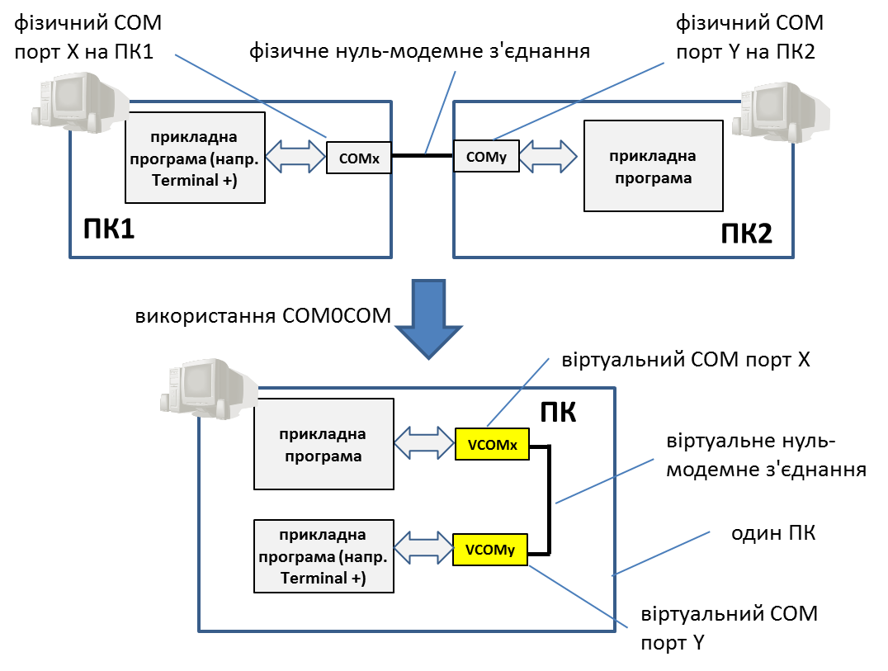
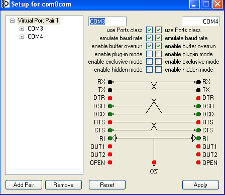

[ЛР.2.Асинхронні послідовні інтерфейси](lab2.md)

## Додаток 2.3. Короткий опис роботи утиліти com0com

#### Д2.3.1. Загальні відомості. 

Утиліта COM0COM ([http](http://sourceforge.net/projects/com0com/?source=navbar)[://sourceforge.net/projects/com0com/?](http://sourceforge.net/projects/com0com/?source=navbar)[source=navbar](http://sourceforge.net/projects/com0com/?source=navbar)) імітує роботу нуль-модемного з’єднання. 

Для пояснення призначення та принципів його роботи спочатку розглянемо приклад фізичного нуль-модемного з’єднання (див. рис.Д19). Два комп’ютери ПК1 та ПК2 з'єднані  нуль-модемним кабелем. Це з'єднання використовують прикладні програми для обміну даними в символьному режимі. Тобто прикладна програма на ПК1 використовує порт "COMx", а на ПК2 – порт "COMy", які фізично з'єднані між собою кабелем.  

 

Рис.Д19

У деяких випадках потребується обмін програм через нуль-модемне з’єднання на одному і тому ж ПК. Як правило, це робиться для тестування роботи прикладних програм, або для певних комунікаційних утиліт. При використанні фізичного нуль-модемного з'єднання потребується два COM-порти на одному і тому ж ПК, що не завжди можливо і доцільно. Замість цього можна скористатися віртуальним нуль-модемним з'єднанням, яке можна організувати безкоштовною утилітою COM0COM.

Утиліта COM0COM створює два віртуальні СОМ-порти, між якими імітується повнодуплексне з’єднання. Таким чином все, що буде відправлятися на один порт - буде отримуватися на іншому і навпаки. Таке з'єднання не повністю імітує роботу фізичного аналогу, але достатнє для виконання обміну між прикладними програмами по послідовному інтерфейсу.  

На віртуальній машині, що підготовлена для курсу "Промислові мережі та інтеграційні технології" утиліта COM0COM вже інстальована і налаштована на порти COM3 та COM4. Якщо у Вас є необхідність працювати на інших ПК, утиліту можна завантажити з [http](http://sourceforge.net/projects/com0com/?source=navbar)[://sourceforge.net/projects/com0com/?](http://sourceforge.net/projects/com0com/?source=navbar)[source=navbar](http://sourceforge.net/projects/com0com/?source=navbar). У цьому випадку слід мати на увазі що на 64-розрядних ОС є нюанси використання (деталі описані на сторінці підтримки програми).     

#### Д2.3.2. Налаштування роботи. 

Для налаштування параметрів роботи утиліти, необхідно запустити її конфігуратор 

*Пуск**->Программы->**COM**0**COM**->**Setup*

Перед запуском конфігуратору необхідно закрити усі програми, що використовують віртуальні СОМ-порти з даного віртуального нуль-модема.  

На рис.Д20 показано вікно налаштування віртуальних нуль-модемних з'єднань. Для кожного нуль-модему можна визначити параметри та налаштувати з’єднання віртуальних контактів.  Контакти TX та RX з’єднані між собою перехресно і це з'єднання не може бути змінено. Інші контакти які можуть бути вихідними (червоні) або вхідними (зелені) можуть бути з’єднані між собою. Кожний червоний контакт (вихідний) може бути з’єднаний з будь-якою кількістю зелених контактів (вихідних).

 

рис.Д20

Віртуальний нуль-модем дозволяє інвертувати сигнали. Для цього необхідний вхідний контакт "мітиться" трикутником (знаком інверсії). Інвертування ставиться та знімається подвійним кліком по контакту.   

Окрім 9-ти контактів визначених в стандарті RS232-C, є додаткові контакти. Так, наприклад, контакт "ON" використовується для видачі логічної "1". Таким чином, за необхідності подачі постійного сигналу на якийсь зелений контакт, туди підключається ON, а у випадку постійної відсутності сигналу - інвертований ON. Так, наприклад для сигналу "RI" заведений постійний OFF.  

На рис.Д20 показана конфігурація з повним нуль-модемним з’єднанням. На відео продемонстровано, як можна зробити мінімальне нуль-модемне з'єднання.

<https://www.youtube.com/watch?v=IEyKpovClpk&feature=player_embedded>

На наступному відео показано як можна зробити повне нуль-модемне з’єднання.

<https://www.youtube.com/watch?v=rE1PvVoQZ3U&feature=player_embedded>