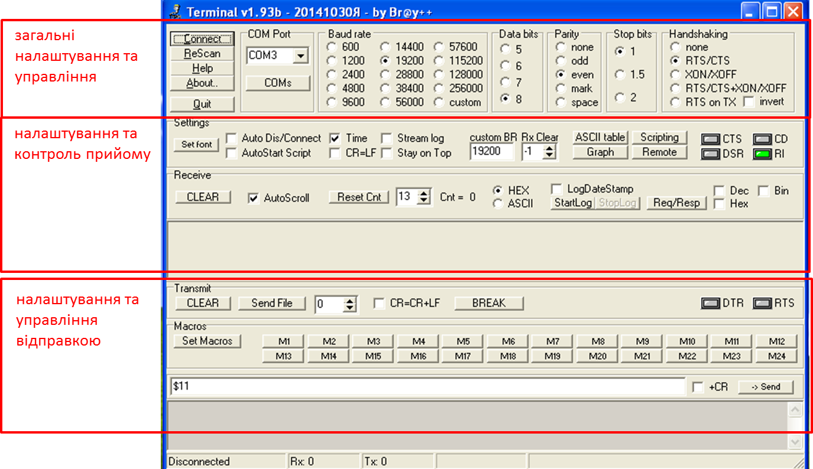

## Додаток 2.4. Короткий опис роботи утиліти terminal

#### Д2.4.1. Загальні відомості. 

Безплатна утиліта TERMINAL від Br@y++ (https://sites.google.com/site/terminalbpp/) призначена для роботи з послідовними портами комп’ютеру: відправки та прийому даних в режимі передачі ASCII символів або байтової послідовності.     

Серед переваг утиліти порівняно з аналогами можна виділити:

- єдине інтегроване вікно налаштувань і роботи

- простота

- наявність макросів

- безплатність

- можливість запису в файл та з файлу

- можливість передачі ASCII-символів та значення байтів в одному посиланні 

Тим не менше, утиліта TERMINAL має певні незручності при роботі з байтовою послідовністю, "буферизує" дані при прийомі та інші особливості. Тому в ряді випадків краще користатися іншими програмами такого типу, наприклад Com Port Toolkit. У лабораторній роботі використовуються обидві наведені утиліти:

- TERMINAL вже встановлений на віртуальній машині, підготовленій для курсу "Промислові мережі та інтеграційні технології"

- Com Port Toolkit завантажується та інсталюється з сайту самостійно

#### Д2.4.2. Налаштування та робота. 

На рис. Д21 показане вікно утиліти TERMINAL. 

рис.Д21

Більшість налаштувань повинна бути розуміла користувачам, які ознайомлені з принципами роботи інтерфейсу RS232. 

Тут наведемо декілька:

- Connect: підключитися до вказаного потру в "COM Port" 

- Handshaking: налаштування управління потоком

- Clear: очистити вікно прийому/відправки

- вибір HEX/ASCII: режим відображення основного вікна прийому (HEX- коди, ASCII - символи)

- опції DEC, HEX, Bin: показати додаткові вікна прийому у відповідному форматі 

- Send: відправити дані

За необхідності відправити дані в форматі ASCII-символів, ці символи вказуються в полі відправки. Якщо необхідно відправляти дані байт-кодами, їх значення вказується після символу `$`.    

Приклад роботи Terminal можна подивитися на наступному відео, в якому дві утиліти обмінюються даними через віртуальне нуль модемне з’єднання.  

<https://www.youtube.com/watch?v=yh0L7_AS1B0&feature=player_embedded>