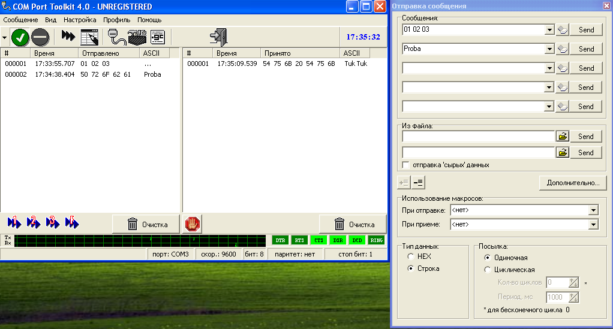

## Додаток 2.5. Короткий опис роботи утиліти Com Port Toolkit

#### Д2.5.1. Загальні відомості. 

"COM Port Toolkit - программа для работы с последовательным портом компьютера, сочетающая в себе возможности терминала, просмотра, журналирования и экспорта данных." (http://www.compt.ru/ru/index.php)

"COM Port Toolkit доступен для бесплатного скачивания и использования в течении 30-дневного периода. Когда период ознакомления с программой истечет, Вы должны зарегистрировать свою копию программы, или прекратить использование и удалить ее из своей системы. Как только мы получим уведомление об оплате программы, на ваш e-mail будет выслана лицензия и регистрационный ключ." (http://www.compt.ru/ru/purchase.php )

Утиліту COM Port Toolkit необхідно завантажити і інсталювати на віртуальну машину самостійно, в комплект встановлених програм віртуальної машини дисципліни вона НЕ ВХОДИТЬ.   

#### Д2.5.2. Налаштування та робота. 

Зовнішній вигляд програми показано на рис.Д22

рис.Д22

Налаштування доступні через головне меню. При завантаженні програми в англомовному варіанті, можна перейти на російськомовний: *Options->**Language->**Russian* .

Настройка COM-порту: Настройка->COM-порт

Набрати і відправити послідовність символів: *Сообщение->Отправить* 

Управління сигналами RTS, DTR відбувається за допомогою відповідних кнопок на панелі інструментів: кнопка вверх – увімкнути, кнопка вниз – вимкнути.

Приклад роботи COM Port Toolkit можна подивитися на наступному відео, в якому дві утиліти обмінюються даними через віртуальне нуль модемне з’єднання.  

<https://www.youtube.com/watch?v=HgAsavZ1BAs&feature=player_embedded>