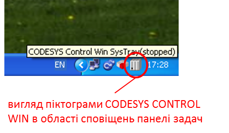
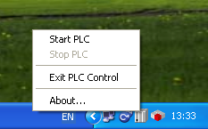

## Додаток 2.6. Короткий опис та Користування CODESYS Control Win

#### Д.2.6.1. Призначення. 

CodeSys – **середовище розробки** прикладного програмного забезпечення для різного типу контролерів (https://ru.wikipedia.org/wiki/CoDeSys). Так само як UNITY PRO є середовищем програмування/налагодження ПЛК Modicon M340, Premium, M580 та Quantum, CodeSys використовується для ряду інших контролерів, в яких виконується **середовище виконання** (так званий Runtime) CodeSys. Середовище виконання CodeSys існує не тільки для промислових контролерів з операційними системами реального часу, а і для платформ Windows, зокрема таким є **CodeSys Control Win**.

У деяких лабораторних роботах використовується демо-версія CodeSys Control Win, в яких **софт-ПЛК** працює 2 години неперервно, після чого його необхідно перезапускати. На віртуальній машині, яка підготовлена для даної лабораторної роботи вже інстальований CodeSys Control Win. Якщо у Вас є необхідність завантажити його на інший ПК, це можна зробити на офіційному сайті 3S, попередньо зареєструвавшись http://store.codesys.com/codesys-control-win-sl.html

Середовище CodeSys Control Win замінює в лабораторних роботах реальний ПЛК. Студенти користуються ним як "чорним ящиком", не вникаючи в подробиці роботи. Тим не менше його необхідно налаштовувати і запускати, коротко про це описано нижче. 

#### Д.2.6.2. Принципи функціонування. 

При старті ОС (у нашому випадку на віртуальній машині), середовище CodeSys Control Win запускається автоматично. Контроль та керування роботою середовища проводиться через панель сповіщень, нажавши мишкою по відповідній піктограмі (рис.Д23).  

рис.Д23

При старті Windows середовище CodeSys Control Win знаходиться в режимі зупинки ПЛК (PLC в Stop). Для запуску ПЛК необхідно викликати команду "Start PLC" а для зупинки - "Stop PLC" (рис.Д24).  

 

рис.Д24

Надалі софт-ПЛК, що імітується середовищем CodeSys Control Win будемо називати ***віртуальним ПЛК***. 

Виконавчі файли середовища CodeSys Control Win а також конфігурація віртуального ПЛК знаходяться в папці "C:\Program Files\3S CODESYS\GatewayPLC". Для кожної лабораторної роботи в курсі "Промислові мережі та інтеграційні технології" створена своя конфігурація та програма віртуального ПЛК. Для того щоб скопіювати в потрібне місце необхідні файли, до лабораторних робіт буде надаватися архів з цими файлами а також файл з розширенням ".CMD", по запуску якого заміна буде проводитись автоматично. 

Для даної лабораторної роботи необхідні файли містяться в папці "Lab2_2", для копіювання необхідно запустити lab2_2.cmd. Після чого можна запустити віртуальний ПЛК.

<https://www.youtube.com/watch?v=PKwqV4ABGy8&feature=player_embedded>

На показаному вище відео видно, що ПЛК супроводжується людино-машинним інтерфейсом, за допомогою якого Ви будете з ним взаємодіяти.

У випадку зависання віртуального ПЛК чи закінчення демонстраційного часу, необхідно зупинити його і запустити знову. 