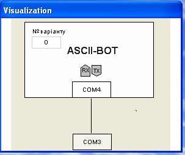

## Додаток 2.7. Призначення ASCII-BOT та опис протоколу обміну з ним.

#### Д.2.7.1. Призначення. 

***ASCII-BOT*** – це проект для віртуального ПЛК CodeSys Control Win, розроблений на кафедрі ІАСУ НУХТ спеціально для даної лабораторної роботи. Задача студента – отримати від ASCII-BOTа завдання. Цілю такого спілкування з ботом є розуміння принципів використання протоколів обміну. 

ASCII-BOT має візуальний інтерфейс (рис.Д25) за допомогою якого можна побачити його активність (індикатори RX, TX). Бот підключений до віртуального порту COM4, який в свою чергу через віртуальний нуль-модем з’єднаний з COM3. Таким чином, щоб обмінюватися з ботом, необхідно відправляти команди і отримувати відповіді з порту COM3.  

рис.Д25

#### Д.2.7.2. Опис протоколу обміну. 

Для того щоб спілкуватися з будь-яким пристроєм по мережі необхідно визначити правила спілкування. Для спілкування з ASCII-BOTом визначені наступні правила (протокол обміну).

1. Обмін відбувається з використанням текстових повідомлень.

2. Між користувачем (клієнтом) і ботом (сервером) ведеться діалог: ASCII-BOT очікує **запит** від користувача, після чого надсилає йому **відповідь**, якщо запит боту зрозумілий. 

2. Починається обмін з вітання-запиту користувача словом "**Привіт**". Якщо вітання-запит прийнято, ASCII-BOT відповідає "**Привіт!Який у Вас номер варіанту?**"

3. Після виконання п.2 необхідно відправити номер свого варіанту, після чого бот повинен спитати, чи дійсно це варіант згідно Вашого прізвища.

4. Якщо після п.3 відправити підтвердження "**так**", бот повідомляє Вам завдання згідно варіанту, якщо інше слово, бот переходить до п.2.     