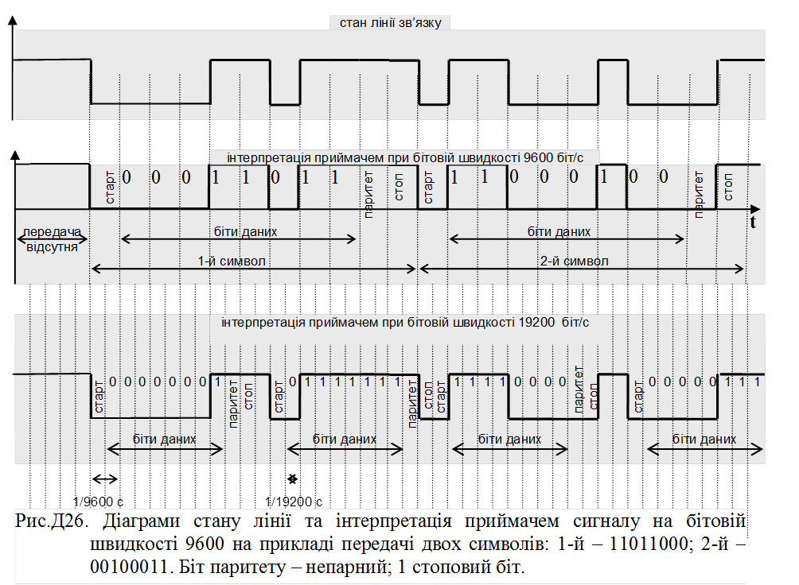

[ЛР.2.Асинхронні послідовні інтерфейси](lab2.md)

## Додаток 2.8. Оформлення звіту до частини 2.

#### Пункт 2. Реалізація повного нуль-модемного з’єднання.

*Навести копію екрану.*

Рис. Налаштування віртуального повного нуль-модемного з'єднання COM0COM. 

#### Пункт 5. Відправка/прийом символьної послідовності.

*Навести копію екрану.*

Рис. Відправка/прийом символьної послідовності.

#### Пункт 6. Відправка/прийом байтової послідовності.

*Навести копію екрану.*

Рис. Відправка/прийом байтової послідовності в HEX-форматі .

#### Пункт 7. Управління додатковими сигналами.

Коротко описати що відбувалося і чому. 

#### Пункт 8. Реалізація мінміального нуль-модемного з’єднання.

*Навести копію екрану.*

Рис. Налаштування віртуального мінімального нуль-модемного з'єднання COM0COM. 

#### Пункт 9. Управління додатковими сигналами.

Коротко описати що відбувалося і чому. 

#### Пункт 10. Отримання додаткового завдання.

*Навести копію екрану.*

Рис. Сесія спілкування з ASCII-BOTом. 

#### Пункт 11. Рисування діаграми.

*Навести дані на швидкості 9600 та 19200.*

*Навести рис. діаграми, за прикладом рис.Д26.*

