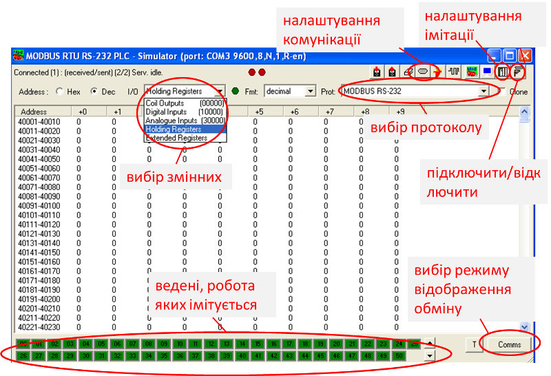
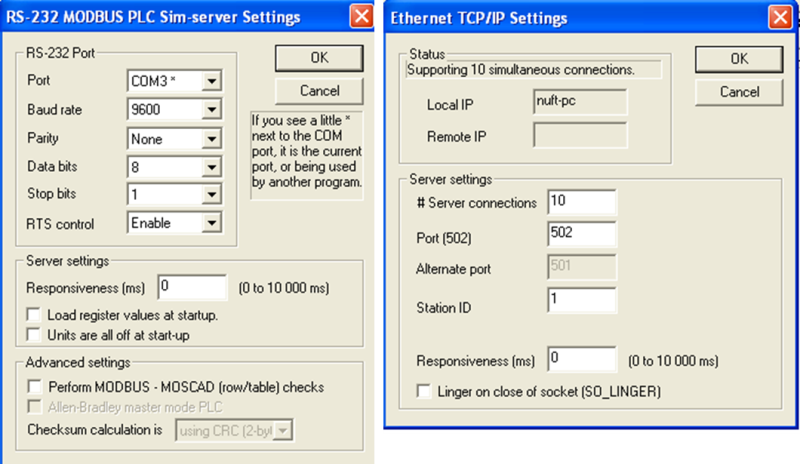
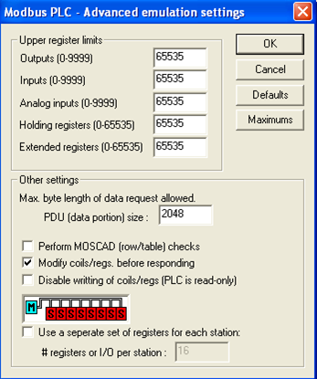
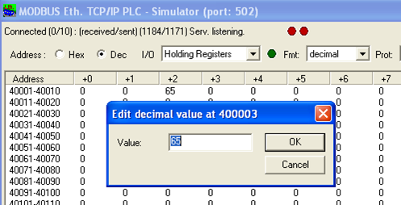

[ЛР.3.Основи функціонування MODBUS](lab3.md)

## Додаток 3.1. Утиліта Modbus PLC Simulator.

#### Д.3.1.1. Призначення

#### http://www.plcsimulator.org   

 ***Modbus*** ***PLC*** ***Simulator*** — це програма для імітації роботи ПЛК з підтримкою протоколів Modbus RTU Slave, Modbus TCP Server а також деяких інших протоколів промислових мереж. Програма являється безкоштовною, останні версії можна завантажити з сайту автору http://www.plcsimulator.org/downloads. У даній лабораторній роботі ця утиліта використовується для тестування з’єднання програм Modbus -клієнтів з Modbus-сервером.

На віртуальній машині  Modbus PLC Simulator відсутній. Для її встановлення необхідно завантажити зs сторінки автора:

- виконавчий файл утиліти (наприклад версії 8.19) http://www.plcsimulator.org/downloads/mod_RSsim_8_19.zip?attredirects=0

- файл REG для зміни реєстру http://www.plcsimulator.org/downloads/Vista_key.reg?attredirects=0

Після завантаження, необхідно запустити на виконання файл Vista_key.reg, для внесення ключа ліцензії в реєстр Windows.

#### Д.3.1.2. Опис деяких функцій. 

http://www.plcsimulator.org/documentation

Загальний вигляд програми показаний на рис.Д3.1. 

Програма може працювати в режимах:

- перегляду та зміни змінних, або

- перегляду активності обміну. 

Режим перемикається кнопкою "Comms".   

Рис.Д3.1

Перед формуванням з’єднання (до COM-порта або до порту TCP) вибирається потрібний протокол. Далі налаштовуються комунікаційні опції (рис.Д3.2).  

Рис.Д3.2

Modbus PLC Simulator може імітувати роботу будь якого Веденого (Slave) і за замовченням імітує їх усіх. У нижній частині вікна видно список вузлів Ведених (Slave), які імітуються. Номер вказує на адресу Веденого, зелений колір вказує на те, що Ведений з даною адресою імітується. Клік по прямокутнику з номером активує/деактивує Веденого зі вказаним номером.

За замовченням змінні Modbus, які імітуються на Ведених є спільними, тобто зміна любої змінної відбувається на усіх Ведених одночасно. Діапазон адрес змінних, які імітуються задається у вікні налаштування імітації ПЛК (рис.Д.3.3). Налаштування "Upper register limits" задає максимальне значення адреси відповідної змінної Modbus. 

Рис.Д3.3 

Змінні Modbus, які необхідно подивитися чи змінити вибираються у верхній частині основного вікна (див.рис.Д3.1) у відповідному спадаючому списку.  Змінні розташовуються в рядках групами. Діапазон відображених змінних показується в поле Address. Для зміни значення змінної необхідно натиснути на ній і в полі для вводу ввести значення (рис.Д.3.4). 

Рис.Д3.4