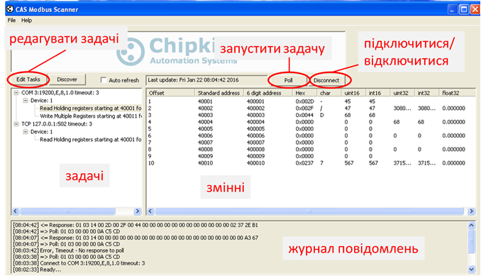
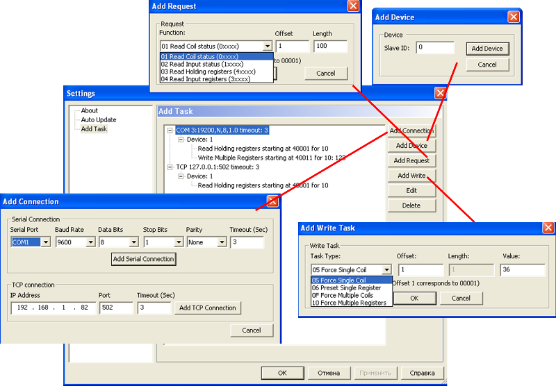
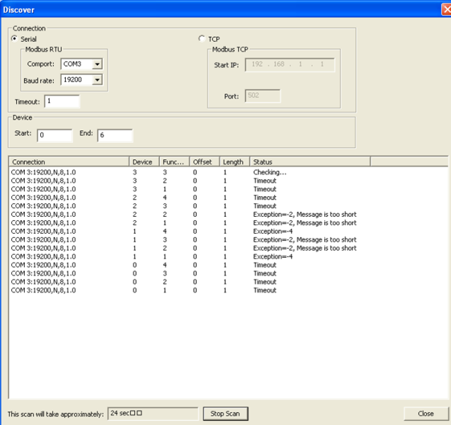

[ЛР.3.Основи функціонування MODBUS](lab3.md)

## Додаток 3.2. Утиліта CAS Modbus Scanner.

#### Д.3.2.1. Призначення (http://www.chipkin.com/products/software/modbus-software/cas-modbus-scanner/ ). 

***CAS*** ***Modbus*** ***Scanner*** — це тестова програма Modbus Client, яка призначена для зчитування/запису змінних Modbus. Вона працює з Modbus RTU та Modbus TCP.

Можливості утиліти:

-       читання coil status (0xxxx), input status(2xxxx), input registers (3xxxx) та holding registers (4xxxx);

-       індивідуальний та груповий запис coil (0xxxx) та holding registers (4xxxx);

-       дані можуть бути відображені в Binary, HEX, Uint16, Int16,Uint32, Int32 та Float32

-       пошук пристроїв в мережі 

-       декілька з’єднань 

-       працює з RS232, RS485 та TCP

-       безкоштовна

У лабораторних роботах дана програма використовується в якості тестового Modbus Client. Утиліта вже інстальована на віртуальній машині. 

#### Д.3.2.2. Опис деяких функцій.   

Загальний вигляд програми показаний на рис.Д3.5. Для формування запитів, які будуть відправлятися до Modbus Server в даній утиліті використовуються так звані "задачі" (Tasks). Спочатку користувач конфігурує необхідні задачі, а потім запускає їх за допомогою команди Poll. Якщо задача призначена для зчитування змінних, при позитивному результаті виконання задачі, їх значення буде показане у вікні змінних у різному форматі. Журнал повідомлень запитів і відповідей а також результатів виконання задач показаний внизу вікна.   

 

Рис.Д3.5

Для створення чи редагування задачі необхідно натиснути на кнопку "Edit Tasks". У вікні редагування задачі (Рис.Д.3.6) нові задачі добавляються шляхом поступового створення з'єднання (Add Connection), добавлення пристрою (Add Device), добавлення запиту на читання (Add Request) або на запис (Add Write). При створенні нової задачі слід звернути увагу на наступне:

- перед добавленням пристрою у списку задач необхідно вибрати з'єднання (Connection) в межах якого буде даний пристрій

- перед добавлення запиту треба вибрати пристрій, до якого цей запит буде надсилатися.

Існуючі задачі можна редагувати натиснувши на копку "Edit".

Рис.Д3.6

CAS Modbus Scanner має функцію пошуку пристроїв (Discover) на Modbus RTU та в межах однієї IP-адреси Modbus TCP, а також визначення підтримуваних ним функцій та орієнтовного діапазону досяжних Modbus змінних. Дана функція працює на механізмі поступового формування групових запитів на читання (функції 01,02,03,04) до пристроїв з адресами, визначених в діапазоні Start-End (Рис.Д.3.7). У полі Timeout задається максимальний час очікування відповіді на запит. Рекомендується виставити таймаут в 1 с для пришвидшення пошуку.    

Рис.Д3.7

Приклад роботи CAS Modbus Scanner сумісно з Modbus PLC Simulator показаний на відео. 

https://youtu.be/wp2CmnRlPus 