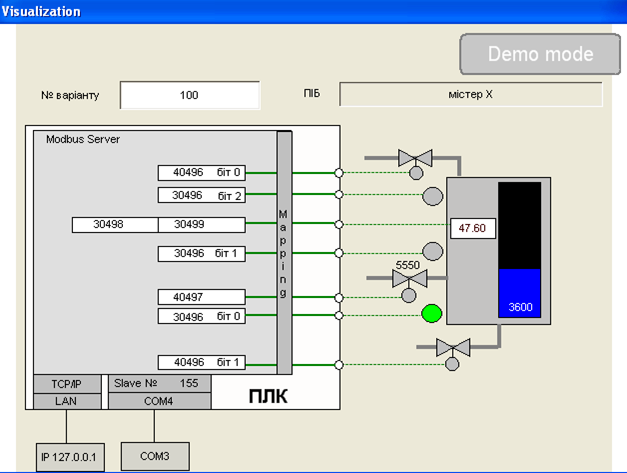

[ЛР.3.Основи функціонування MODBUS](lab3.md)

## Додаток 3.3. Опис віртуальної лабораторної установки.

#### Д.3.3.1. Призначення

У даній лабораторній роботі використовується віртуальна установка (ПЛК + імітатор об’єкту), які розроблені на базі CodeSys Control Win на кафедрі ІАСУ НУХТ. Віртуальний контролер має інтерфейси Modbus RTU та Modbus TCP. Задача студента – за допомогою утиліти Modbus Client контролювати та керувати об’єктом, маючи карту відображення регістрів (Mapping).

Завантажити файли виконання можна за наступним посиланням. 

https://drive.google.com/file/d/0B2FfwwwweBSVTm4xTThySm5KSjA/view?usp=sharing Після завантаження Lab3.rar його необхідно розпакувати, скопіювати папку на віртуальну машину та запустити на виконання lab3.cmd. 

#### Д.3.3.2. Опис інтерфейсу

На рис.Д.3.8 показаний зовнішній вигляд графічного інтерфейсу віртуальної установки. Після запуску віртуального контролеру CodeSys (див. лабораторну роботу №2), в полі варіанту необхідно вказати свій варіант. Після введення варіанту, в полі ПІБ повинно висвітися прізвище та ім’я студента. Для ініціалізації правильних нааштувань необхідно обов’язково перезавантажити віртуальний ПЛК. Повторне завантаження буде автоматично містити потрібний номер варіанту та потрібні комунікаційні налаштування.   

Рис.Д3.8

Віртуальний ПЛК має два інтерфейси для роботи з Modbus:

1) Modbus RTU Slave, 9600 біт/с, без паритету, який використовує на віртуальній машині порт СОМ4; адреса Slave залежить від варіанту і вказується над портом – на вказаному прикладі (рис.Д3.8) – 155.  

2) Modbus TCP/IP Server, який використовує стек TCP/IP віртуальної машини, до якого можна звернутися через IP адресу 127.0.0.1 (localhost) та TCP-порт 502.  

Таким чином через ці два інтерфейси він виступає в якості Modbus Server (відмінність понять Client-Server, Master-Slave а також деталі роботи Modbus RTU та Modbus TCP/IP розглядаються в наступних темах).   

Віртуальний ПЛК підключений до віртуального об’єкту – баку для нагрівання рідини. Об’єкт керується в дистанційному режимі через Modbus змінні. Номери змінних залежать від варіанту. На рис.Д3.8 показане наступне відображення входів/виходів ПЛК на Modbus змінні:

- клапан набору (BOOL): 0-й біт в Holdnig Registers 496;

- клапан зливу (BOOL): 1-й біт в Holdnig Registers 496;

- клапан нагрівання (INT): Holdnig Registers 497; 

- сигналізатор нижнього рівня (BOOL): 0-й біт в Input Register 496;

- сигналізатор середнього рівня (BOOL): 1-й біт в Input Register 496; 

- сигналізатор верхнього рівня (BOOL): 2-й біт в Input Register 496; 

- температура (REAL): Input Register 498, 499; 

Клапан нагрівання для всіх варіантів змінюється в діапазоні 0-10000. Рівень (номер змінної Modbus необхідно визначити самостійно) в усіх варіантах змінюється в діапазоні 0-10000. Температура має формат REAL і змінюється в залежності від ступені відкриття клапану нагрівання.  