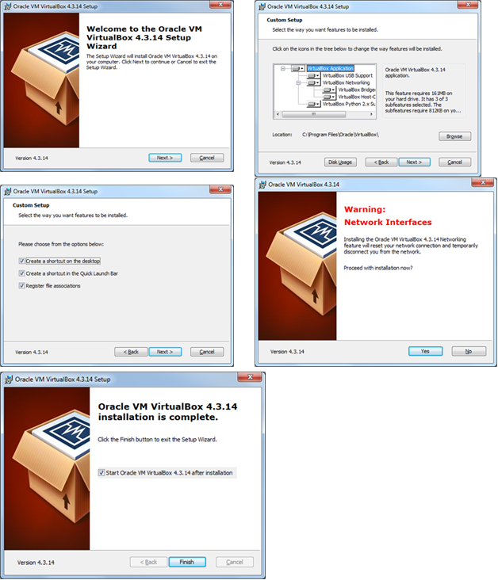
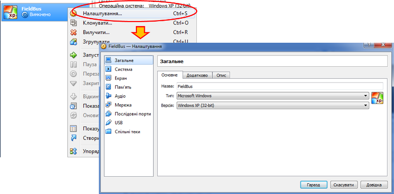
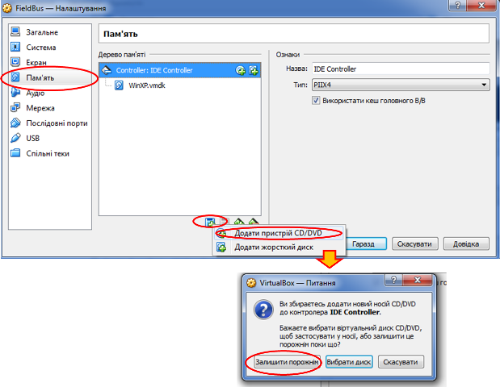

# ЛАБОРАТОРНА РОБОТА № 1 (Дистанційна форма).

**Налаштування робочого місця для проведення лабораторних робіт.** 

## Лабораторна робота.

**Тривалість**: 0.5 - 1 акад. година.

**Мета:** Підготовити віртуальне робоче місце для проведення лабораторних робіт дистанційної частини курсу "Промислові мережі та інтеграційні технології".

### Лабораторна установка.

**Необхідне апаратне забезпечення.** Для проведення лабораторних робіт необхідно мати комп’ютер з наступною мінімальною апаратною конфігурацією:

- CPU Intel/AMD 1 ГГц / RAM 2 ГБ / HDD 10 ГБ (вільних)  

**Необхідне програмне забезпечення.** 

1.           На комп’ютері повинна бути встановлена одна з операційних систем, підтримуваних віртуальною машиною Virtual Box (https://www.virtualbox.org/wiki/Downloads):

- Windows 

- Mac OS X

- Linux

- Solaris

2.           Безкоштовне програмне середовище віртуалізації Virtual Box https://www.virtualbox.org/wiki/Downloads .

3.           Образ віртуальної машини для віртуального робочого місця (https://cloud.mail.ru/public/J5jM/gKhiw8Vj8 ).

4.           Інтернет-браузер та доступ до Інтернет. 

**Загальна постановка задачі**. Цілі роботи: 

1)   підготовити віртуальне робоче місце для проведення наступних лабораторних робіт;

2)   навчитися користуватися мінімальними можливостями середовищ віртуалізації на прикладі Virtual Box 

### Послідовність виконання роботи.

1.   Ознайомтеся з можливостями середовища віртуалізації VirtualBox, користуючись додатком Д1.1.1. Завантажте VirtualBox для Вашої операційної системи та встановіть його собі на комп’ютер (Д.1.1.2). Після встановлення змініть мову середовища VirtualBox на зручну для Вас.    

2.   Завантажте образ віртуальної машини для віртуального робочого місця, у випадку якщо Ви його не змогли отримати на кафедрі ІАСУ (https://cloud.mail.ru/public/J5jM/gKhiw8Vj8 ).

3.   Встановіть образ віртуальної машини відповідно до пункту Д1.1.3 додатку. У випадку не вдалого встановлення спробуйте другий спосіб, описаний в Д1.1.4.

4.   Користуючись пунктом Д.1.1.6 встановіть на віртуальну машину гостьові доповнення та налаштуйте її.    

5.   Користуючись додатком Д1.2 ознайомтеся зі складом інстальованого програмного забезпечення на віртуальній машині, підготовленій для лабораторних робіт.

### Оформлення роботи.

Після закінчення роботи, відправте звіт у форматі DOC чи PDF, оформлений відповідно до додатку Д.1.3. 

### Перевірка виконання роботи та питання до захисту.

Викладачем перевіряється виконання всіх пунктів роботи відповідно до занотованих у звіті результатів. Оцінюється повнота результатів. Кінцева оцінка коригується по усному опитуванню при очному спілкуванню. Кожен результат студент повинен пояснити. У випадку виникнення помилок або запитань щодо проведення певного пункту, його необхідно буде повторити.  

## Додаток 1.1. Середовище віртуалізації Virtual BOX.

#### Д.1.1.1. Призначення (https://uk.wikipedia.org/wiki/VirtualBox ).     

 ***VirtualBox*** — це програма віртуалізації для операційних систем, розроблена німецькою фірмою innotek, зараз вона належить Oracle Corporation. Вона встановлюється на існуючу операційну систему, яка називається ***хостовою***, усередину цієї програми встановлюється друга операційна система, яку називають ***гостьовою*** ***операційною системою*** яка функціонує на ***віртуальній машині*** ([https://uk.wikipedia.org/wiki/%D0%92%D1%96%D1%80%D1%82%D1%83%D0%B0%D0%BB%D1%8C%D0%BD%D0%B0_%D0%BC%D0%B0%D1%88%D0%B8%D0%BD%D0%B0](https://uk.wikipedia.org/wiki/Віртуальна_машина) ).

Підтримується основними операційними системами Linux, FreeBSD, Mac OS X, OS/2 Warp, Microsoft Windows, які підтримують роботу гостьових операційних систем FreeBSD, Linux, OpenBSD, OS/2 Warp, Windows і Solaris.

У курсі "Промислові мережі та інтеграційні технології" VirtualBox використовується для створення віртуального робочого місця. На це є наступні причини:

- кросплатформеність,     незалежність від хостової системи, при необхідності мати робочу (гостьову)     систему тільки Microsoft Windows XP;
- однаковість     віртуальних робочих місць для кожного учасника курсу;
- наперед-встановлене     програмне забезпечення для проведення лабораторних робіт
- організація     мережі між віртуальною машиною та хостовою, що потрібно в деяких     лабораторних роботах       

**Студент має право не використовувати VirtualBox і користуватися рідною ОС або іншими середовищами віртуалізації, якщо вони сумісні з** **Windows** **XP. Перелік необхідного ПЗ наводиться на початку кожної лабораторної роботи, а його опис - в додатках. При цьому працездатність необхідного ПЗ не гарантується!** 

 

#### Д.1.1.2. Порядок завантаження та встановлення на хостову ОС.

1)  Завантажити VirtualBox з https://www.virtualbox.org програму VIRTUAL BOX відповідно до вашої операційної системи (рис.Д1)

2)  Запустити процес установки (рис.Д.2)

3)  У процесі установки декілька раз може виникнути вікно з інформацією про несумісність з Вашою операційною системою. У ньому потрібно вибрати «ВСЕ РАВНО ПРОДОЛЖИТЬ» (рис.Д.3)

 

4)  Після закінчення процесу установки необхідно перезавантажити комп’ютер (Рис.Д.4)

 

5) Для налаштування середовища Virtual Box, необхідно зайти в меню File->Preferences… На рис.Д.5. показано як можна змінити мову. 

#### Д.1.1.3. Підключення образу віртуальної машини (Варіант 1). 

Завантажити VirtualBox 

1)    Запустити на виконання VirtualBox. У вікні налаштування вибрати "Файл/импорт конфигураций" (рис.Д.6)

2)  Вказати шлях до образу віртуальної машини: папка «Дистанційна Пром мереж» файл FieldBus.ovf

3)  Налаштувати (конфігурувати) віртуальну машину з наступними параметрами (рис.Д.8):

1.     Кількість оперативної пам’яті (>=1024 Мб);

2.     Місце збереження файлів віртуальної машини (вибрати самостійно)

Після визначення параметрів конфігурування вибрати команду «ИМПОРТ».

4)    Після закінчення імпорту віртуальна машина буде готова до експлуатації. Перевірте роботу машини (див. п. Д.1.1.5). Якщо випадає "синій екран смерті" спробуйте підключити машину через послідовність, описану в Д.1.1.4. 

#### Д.1.1.4. Підключення образу віртуальної машини (Варіант 2). 

1)        Запустити на виконання VirtualBox. У вікні налаштування вибрати «СОЗДАТЬ». У вікні що з’явилось вказати довільне ім’я віртуальної машини, вибрати тип Microsoft Windows, версію Windows XP (32 bit), і натиснути «Next» (рис.Д.9)

2)        Вказати кількість оперативної пам'яті яка буде виділятися для роботи віртуальної машини (для коректної роботи необхідно хоча б 1024 МБ) і натиснути «Next» (рис.Д.10)

3)    Вибрати поле «Использовать существующий виртуальный жесткий диск» (рис.Д.11) 

- вказати шлях до нього: папка «Дистанійна Пром мереж» файл WinXp.vmdk

- натиснути «Создать»

4)    Перевірте роботу машини (див. п. Д.1.1.5).

#### Д.1.1.5. Запуск, налаштування і робота з віртуальною машиною.

1. Для запуску віртуальної машини, вона вибирається зі списку і викликається команда «ЗАПУСТИТЬ» (рис.Д.12)

Швидкі клавіші для роботи з віртуальною машиною

| Right Ctrl + F   | Перехід вікна віртуальної машини в повноекранний  режим |
| ---------------- | ------------------------------------------------------- |
| Right Ctrl + С   | Перехід вікна віртуальної машини в режим масштабування  |
| Right Ctrl + Н   | Завершити роботу віртуальної машини                     |
| Right Ctrl + Del | Відіслати віртуальній машині команду Ctrl + Alt + Del   |
| Right Ctrl + E   | Зробити знімок екрана віртуальної машини                |

2. Для налаштування віртуальної машини, викликається відповідний пункт контекстного меню або з меню "Машина" (рис.Д.13). Налаштування проводиться тільки при зупиненій віртуальній машині.  

#### Д.1.1.6. Встановлення та налаштування гостьових доповнень (Extension Pack).

**1. Завантаження та встановлення плагіну на хостову ОС.**

Для того щоб з’явилась можливість встановлення гостьових доповнень (Extension Pack - додаткових опцій віртуальної машини) необхідно завантажити їх з сайту https://www.virtualbox.org/wiki/Download_Old_Builds відповідно до встановленої версії Virtual Box. 

Після завантаження, необхідно встановити їх на хостовій операційній системі.

**2. Встановлення гостьових доповнень на віртуальну машину.**

1. Для встановлення даного плагіну на віртуальній машинні необхідно щоб в ній був присутній віртуальний пристрій CD/DVD. Якщо в налаштуваннях машини (розділ "Пам'ять") CD/DVD відсутній, необхідно його додати. Для цього в налаштуваннях в пункті "пам'ять" додається новий CD/DVD пристрій, у вікні вибору ресрусу диску вибирається пункт "Залишити порожнім" (рис.Д.16). 

2. Після налаштування необхідно запустити віртуальну машину. У гостьовій ОС в меню віртуальної машини, необіхдно вибрати пнкт 

«Пристрої (Устройство/Device)»-> «Підключити образ диску Гостьові доповнення (Подключить образ диска Дополнений гостевой ОС)»

3. Після встановлення образу з’явиться пристрій VirtualBox Guest Additions (рис.Д.18). 

Гостьові доповнення віртуальної машини використовуються для збільшення функціоналу віртуальної машини (налаштування розширення екрану, додавання спільних папок і т. д). Для встановлення VirtualBox Guest Additions, запускаємо його з образу, слідуючи вказівкам (рис.Д.19-рис.Д.23). 

Після встановлення всіх доповнень необхідно перезавантажити віртуальну машину 

4. Для додавання спільної папки необхідно в Oracle VM VirtualBox Менеджері вибрати необхідну віртуальну машину і натиснути "Налаштування" («Настроить»). У вікні що з’явилось вибрати вкладку "Спільні теки" («Общие папки») і натиснути кнопку додавання нових папок.

Далі необхідно вказати місце знаходження цієї папки(можна додавати цілі локальні диски), а також ім’я даної папки. Також необхідно поставити галочку «Авто-подключение» і натиснути «ОК»

Після цього вона з’явиться у вікні списку спільних папок а також в гостьовій ОС. 

## Додаток 1.2. Опис віртуальної машини

#### Д.1.2.1. Призначення. 

Віртуальна машина спеціально підготовлена для проведення лабораторних робіт по дистанційній частині курсу "Промислові мережі та інтеграційні технології" в Національному університеті харчових технологій. Образ машини (https://cloud.mail.ru/public/J5jM/gKhiw8Vj8) містить мінімальний набір наперед встановленого спеціалізованого програмного забезпечення на базі операційної системи Windows XP SP3.   

#### Д.1.2.2. Загальний перелік утиліт.  

1) com0com – утиліта для емуляції COM-портів, з’єднаних нуль-модемним з’єднанням (http://sourceforge.net/projects/com0com/?source=navbar) 

2) terminal.exe – утиліта для робти з COM-портом (https://sites.google.com/site/terminalbpp)

3) CAS Modbus Scanner – утиліта Modbus-Client для роботи з Modbus RTU/TCP Server (http://www.chipkin.com/products/software/modbus-software/cas-modbus-scanner ). 

4) CodeSys Control Win – середовище виконання софт-ПЛК під ОС Windows (демо-версія на 2 години неперервної роботи) http://store.codesys.com/codesys-control-win-sl.html

5) SCADA VijeoCitect 7.2

## Додаток 1.3. Оформлення звіту

Звіт оформлюється, відповідно до таблиці 1.1. 

Таб.1.1.Звіт до виконання лабораторної роботи.

| № пункта | Приблизний час  виконання | Відмітка про виконання | Примітки щодо особливостей виконання |
| -------- | ------------------------- | ---------------------- | ------------------------------------ |
| 1        |                           |                        |                                      |
| 2        |                           |                        |                                      |
| 3        |                           |                        |                                      |
| 4        |                           |                        |                                      |

Файл з таблицею відправте у відповіді на завдання у форматі DOC або PDF.