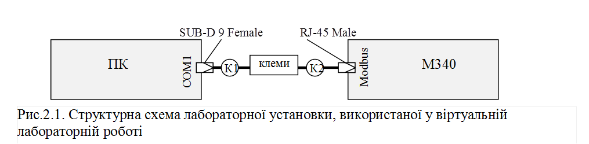
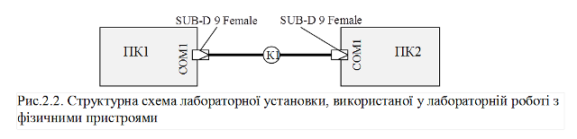

[Лабораторні](README.md)

# ЛАБОРАТОРНА РОБОТА № 2 (Дистанційна форма).

**Асинхронні послідовні інтерфейси.** 

## Частина 1. Підключення пристроїв по інтерфейсу RS-232 та перевірка роботи. 

**Тривалість**: 1 - 2 акад. години.

**Мета:** Навчитись правильно підключати пристрої по інтерфейсу RS-232, діагностувати правильність підключення та роботу.

### Лабораторна установка.

**Мінімально необхідне апаратне забезпечення.** Для проведення віртуальної лабораторної роботи потрібен комп’ютери та гаджети з Веб-доступом . 

**Апаратне забезпечення, матеріали та інструменти для проведення лабораторної роботи з фізичними пристроями.** 

1. Комп’ютер (ПК) з інтерфейсом RS-232 або з USB при наявності перетворювача USB<->RS-232.

2. Пристрій з інтерфейсом RS-232.

3. Відповідні до інтерфейсних роз’єми: SUB-D 9pin розетка (для ПК) та відповідник з боку іншого пристрою.

4. 3-х провідні кабелі – 5 м; при наявності роз’ємів RJ рекомендується використовувати UTP будь-якої категорії, у інших випадках особливих вимог до кабелів немає;

5. клемна колодка 3..9 клем;

6. паяльник з припоєм, викрутка, кусачки, тестер для вимірювання опору (порядку кількох кОм) і напруги (порядку кількох Вольт)      

**Апаратне забезпечення, матеріали та інструменти використані у віртуальній лабораторній роботі (схема на рис.2.1).** 

1. Комп’ютер з інтерфейсом RS-232;

2. ПЛК М340 на базі CPU1000 з вбудованим послідовним каналом RS-232/RS-485 (роз’їм RJ45, маркується як "Modbus");

3. Відповідні до інтерфейсних роз’єми: SUB-D 9pin розетка (для ПК) та RJ-45 вилка (для М340).

4. 8-ми провідний кабель UTP cat5;

5. клеми 8 штук;

6. паяльник з припоєм, викрутка, кусачки, тестер для вимірювання опору (порядку кількох кОм) і напруги (порядку кількох Вольт), інструмент для обжимання роз’їмів типу RJ;      

**Мінімально необхідне програмне забезпечення.** Веб-браузер, доступ до Інтернет.

**Програмне забезпечення для проведення лабораторної роботи з фізичними пристроями.** 

На комп’ютері повинна бути встановлена SCADA/HMI програма або утиліта конфігурування/тестування, що повинна обмінюватися даними з іншим пристроєм через інтерфейс RS-232.

**Програмне забезпечення використані у віртуальній лабораторній роботі.** 

1. На комп’ютері для перевірки працездатності з’єднання використовується SCADA VijeoCitect 7.2.

2. Додатково використовується ПЗ UNITY PRO для програмування ПЛК.

### Загальна постановка задачі. 

Цілі роботи: 

1)   з’єднати комп’ютер з пристроєм по інтерфейсу RS-232;

2)   перевірити правильність з’єднання за допомогою тестера;  

У випадку відсутності необхідного апаратного та програмного забезпечення, усі пункти лабораторної роботи необхідно передивитися на віртуальній лабораторній установці, наведеній в [додатку 2.1](d2_1.md). 

- [Додаток 1](d2_1.md)
- [Додаток 2](d2_2.md)
- [Додаток 3](d2_3.md)
- [Додаток 4](d2_4.md)
- [Додаток 5](d2_5.md)
- [Додаток 6](d2_6.md)
- [Додаток 7](d2_7.md)
- [Додаток 8](d2_8.md)

### Послідовність виконання роботи.

1) Ознайомитись зі схемою нуль-модемного підключення RS-232С до комп’ютера.

Для реальної установки. Припаяти кабель (К1) до розніму SUB-D 9-pin типу розетка, відповідно до повного нуль-модемного з'єднання, за винятком сигналу RI. Одягнути кришку на з’єднувач SUB-D 9-pin. Ваш кабель з одного боку буде розпушений а з іншого мати роз’їм типу SUB-D 9-pin типу розетка. Схему/таблицю підключення занотуйте. 

Для віртуальної установки. Подивіться [п.Д2.1.1](d2_1.md) та занотуйте схему або таблицю підключення (пайки) з вказівкою кольорів та призначення провідників.  

2) Ознайомитись зі схемою нуль-модемного підключення RS-232 до пристрою. 

Для реальної установки. Зробіть кабель підключення (К2) пристрою до клемної колодки:

-     один кінець кабелю повинен бути розпушений для підключення до клемної колодки;

-     при необхідності підключення через роз’їм (наприклад SUB-D 9 або MiniDin) з другого боку кабель необхідно припаяти;

-     при необхідності підключення через роз'їм типу RJ, з другого боку кабель необхідно обжати спеціальним інструментом;

-     кожен провід кабелю промаркуйте (при наявності кольорового маркування проводів кабелю це робити необов’язково) 

-     схему/таблицю підключення занотуйте.  

Для віртуальної установки. Подивіться [п.Д2.1.2](d2_1.md) та занотуйте схему або таблицю підключення з вказівкою кольорів та призначення провідників.  

**Пункти 2-7 робити тільки при вимкненому живленні ПК та пристрою, до якого він підключається, інакше обладнання може вийти з ладу і є небезпека враження електричним струмом!**

3) Підключити пристрій до клемної колодки, перевірити правильність підключення.

Для реальної установки. При вимкненому живленні підключіть пристрій до клемної колодки через підготовлений кабель (К2). Відповідно до маркування знайдіть на клемній колодці клеми RxD та SG, та використовуючи омметр (або тестер у режимі вимірювання опору) виміряйте опір між ними. Порівняйте виміряний опір з наведеним у вимогах до інтерфейсу та занотуйте результат.

   Для віртуальної установки. Подивіться [п.Д2.1.3](d2_1.md), порівняйте виміряний опір з наведеним у вимогах до інтерфейсу та занотуйте результат.  

4) Виміряти і перевірити опір на приймачі СОМ-порту. 

Для реальної установки. При вимкненому живленні знайдіть на своєму ПК СОМ-порт (SUB-D 9-pin типу вилка). Відповідно до схеми знайдіть контакти RxD та SG, та використовуючи омметр (або тестер у режимі вимірювання опору) виміряйте опір між ними. Порівняйте виміряний опір з наведеним у вимогах до інтерфейсу. 

Для віртуальної установки. Подивіться [п.Д2.1.4](d2_1.md), порівняйте виміряний опір з наведеним у вимогах до інтерфейсу та занотуйте результат.  

5) Підключити ПК до клемної колодки, перевірити правильність підключення.

Для реальної установки. Зробіть схему або таблицю підключення кабелю К1 до клемної колодки. Врахуйте необхідність повного чи мінімального нуль-модемного з’єднання, підключення сервісних контактів, тощо, відповідно до вимог вашого пристрою. При вимкненому живленні ПК та пристрою підключіть підготовлений кабель К1 з одного боку до ПК а з іншого до клемної колодки згідно правил нуль-модемного з’єднання. 

   Для віртуальної установки. Подивіться [п.Д2.1.5](d2_1.md). Зробіть схему або таблицю підключення кабелю К1 до клемної колодки. Зробіть висновок щодо її правильності та занотуйте. Зверніть увагу на те, яке з’єднання використовується – повне чи міміальне?  

6) Перевірити правильності з’єднання ПК та пристрою через клемну колодку.

Для реальної установки. При вимкненому живленні ПК та пристрою заміряйте опір між промаркованими TxD та SG що йде від пристрою, та RxD та SG що йде від пристрою. Зробіть висновки щодо правильності підключення, результати занотуйте.

Для віртуальної установки. Подивіться [п.Д2.1.6](d2_1.md). Зробіть висновки щодо правильності підключення, результати занотуйте.

7) Змінити місцями підключення провідників TxD та RxD і перевірити з’єднання. 

Для реальної установки. При вимкненому живленні ПК та пристрою поміняйте місцями TxD та RxD які йдуть від ПК, заміряйте опір між промаркованими TxD та SG що йде від пристрою, та RxD та SG що йдуть від пристрою. Зробіть висновки щодо правильності підключення, результати занотуйте. Виходячи з п.6 та п.7 зробіть правильне підключення. 

Для віртуальної установки. Подивіться [п.Д2.1.7](d2_1.md). Зробіть висновки щодо правильності підключення, результати занотуйте.

8) Виміряти напругу на передавачі пристрою.

Для реальної установки. Подайте живлення на пристрій. Заміряйте напругу між TxD та SG що йдуть від пристрою. Порівняйте значення з вказаними в вимогах до інтерфейсу. Зробіть висновки щодо роботи інтерфейсу, результати занотуйте.

Для віртуальної установки. Подивіться [п.Д2.1.8](d2_1.md). Порівняйте значення з вказаними в вимогах до інтерфейсу. Зробіть висновки щодо роботи інтерфейсу, результати занотуйте.

9) Виміряти напругу на передавачі ПК.

Для реальної установки. Вимкніть пристрій, подайте живлення на ПК. Заміряйте напругу між RxD та SG що йдуть від пристрою. Порівняйте значення з вказаними в вимогах до інтерфейсу. Зробіть висновки щодо роботи інтерфейсу, результати занотуйте.

Для віртуальної установки. Подивіться [п.Д2.1.9](d2_1.md). Порівняйте значення з вказаними в вимогах до інтерфейсу. Зробіть висновки щодо роботи інтерфейсу, результати занотуйте.

10) Налаштувати програмне забезпечення та перевірити з’єднання

Для реальної установки. На ПК завантажте програмне забезпечення, що повинно з’єднуватися з пристроєм. Подайте живлення на пристрій. За необхідності налаштуйте параметри послідовних портів на пристрої та в ПК. У випадку успіху з’єднання - 1-ша частина лабораторної роботи вважається виконаною. У випадку проблем з роботою перевірте та виправте з’єднання чи налаштування ПЗ.

Для віртуальної установки. Подивіться [п.Д2.1.10](d2_1.md). Занотуйте які налаштування і навіщо проводилися для М340 (Unity Pro) та VijeoCitect.         

### Оформлення звіту.

Після закінчення роботи, відправте звіт у форматі DOC чи PDF, оформлений у вигляді, наведеному в [додатку 2.2](d2_2.md).

### Перевірка виконання роботи та питання до захисту.

Викладачем перевіряється виконання всіх пунктів роботи відповідно до занотованих у звіті результатів. Оцінюється повнота результатів. Кінцева оцінка коригується по усному опитуванню при очному спілкуванню. Кожен результат студент повинен пояснити. У випадку виникнення помилок або запитань щодо проведення певного пункту, його необхідно буде повторити. 

## Частина 2. Символьний обмін.

**Тривалість**: 1 – 2 акад. години.

**Мета:** Ознайомлення з принципами та засобами символьного обміну а також утилітами роботи з СОМ-портом.

### Лабораторна установка.

**Мінімально необхідне апаратне забезпечення.** Для проведення віртуальної лабораторної роботи потрібен комп’ютер з характеристиками, наведеними в лабораторній роботі №1.  

**Апаратне забезпечення, матеріали та інструменти для проведення лабораторної роботи з фізичними пристроями (див.рис.2.2).** 

1. Два комп’ютери (ПК) з інтерфейсом RS-232 або з USB при наявності перетворювача USB<->RS-232.

2. Чотири роз’єми SUB-D 9pin типу розетка. 

3. Два 8-х провідні кабелі – 1 м для нуль-модемного з'єднання; 

4. Паяльник з припоєм, викрутка, кусачки;      

**Апаратне забезпечення, матеріали та інструменти використані у віртуальній лабораторній роботі.** 

1. Усі досліди проводяться на віртуальній машині.

**Програмне забезпечення для проведення лабораторної роботи з фізичними пристроями.** 

1.   Утиліта для роботи з СОМ-портом "Terminal" https://sites.google.com/site/terminalbpp 

2.   Утиліта для роботи з СОМ-портом "COM Port Toolkit V4.0". http://www.compt.ru/ru/download.php 

**Програмне забезпечення використані у віртуальній лабораторній роботі.** 

1.   Утиліта для роботи з СОМ-портом "Terminal" https://sites.google.com/site/terminalbpp (вже встановлено на образі віртуальної машини)

2.   Утиліта для роботи з СОМ-портом "COM Port Toolkit V4.0". http://www.compt.ru/ru/download.php (необхідно завантажити та встановити на віртуальній машині)

3.   Віртуальний нуль-модемний емулятор (com0com) http://sourceforge.net/projects/com0com/?source=navbar

4.   CoDeSys Control Win http://store.codesys.com/codesys-control-win-sl.html (вже встановлено на образі віртуальної машини)

5.   Виконавчий проект CoDeSys  https://cloud.mail.ru/public/28oF/PEWEKYX9g 

### Загальна постановка задачі. 

Цілі роботи: 

1) навчитися працювати з програмним утилітами роботи з СОМ-портами;

2) перевірити на практиці принципи роботи символьного зв’язку;  

### Послідовність виконання роботи.

1) Ознайомитись з додатками 2.3-2.7.

2) Реалізувати повне нуль-модемне з’єднання.

Для реальної установки. Зробити повний нуль-модемний кабель. З’єднати комп’ютери через СОМ-порти нуль-модемним з’єднанням. Включити комп’ютери.

**При з’єднанні комп’ютерів через СОМ-порти, один з комп’ютерів повинен обов’язково бути вимкнений!**  

Для віртуальної установки. Користуючись додатком [2.3](d2_3.md) реалізуйте віртуальне нуль-модемне з’єднання між COM3 та COM4, імітуючи роботу ПОВНОГО нуль-модемного кабелю. Зробити копію екрану для звіту. Після налаштування закрити конфігуратор COM0COM.

3) Завантажити [COM PORT](d2_5.md) Toolkit з сайту розробника http://www.compt.ru/ru/index.php, інсталювати та запустити на виконання.

Для реальної установки. Інсталювати та запустити на ПК1 та налаштувати на фізичний СОМ-порт. Бітова швидкість 9600, 8 біт даних, паритет – парний, 1 стоповий біт, без управління потоком.  

Для віртуальної установки. Інсталювати на віртуальній машині. Запустити на виконання та налаштувати на порт СОМ3. Бітова швидкість 9600, 8 біт даних, паритет – парний, 1 стоповий біт, без управління потоком. 

4) **Запустити утиліту** **[Terminal](d2_4.md).**

Для реальної установки. Інсталювати та запустити на ПК2 та налаштувати на фізичний СОМ-порт. Інші налаштування відповідно до п.3 

Для віртуальної установки. Запустити та налаштувати на СОМ4. Інші налаштування відповідно до п.3.

5) **Відправити/прийняти символьну послідовність.**

Для утиліти Terminal виставити режим відображення ASCII, а для COM PORT Toolkit – режим відправки ASCII. Відправити символьну послідовність `ABCDEF abcdef 12345` з COM PORT Toolkit на Terminal та в зворотному напрямку. Зробити копію екрану для звіту.

6) **Відправити/прийняти послідовність у вигляді кодів байт**.

Для утиліти Terminal виставити режим відображення HEX, а для COM PORT Toolkit – режим відправки HEX. Відправити символьну байтову послідовність 

`00 10 25 AA FF EE`

з COM PORT Toolkit на Terminal та в зворотному напрямку. Зробити копію екрану для звіту.

7) **Управління додатковими сигналами**.

З боку Terminal включити а потім виключити сигнали RTS та DTR, подивитися на індикатори службових сигналів в Terminal та COM PORT Toolkit. Повторіть те саме в зворотному напрямку. Результат записати в звіт з поясненнями поведінки. 

8) **Реалізувати мінімальне нуль-модемне з’єднання**.

Повторити пункт 2 але для МІНІМАЛЬНОГО нуль-модемного з’єднання. 

9) **Повторити пункт 7 при мінімальному нуль-модемі**.

10) **Отримати додаткове завдання.**

 Для реальної установки. Змінити бітову швидкість на РС2 з 9600 на 19200 біт/с. Відправити з РС1 на РС2 байтову послідовність 

`14 E1`

Отримані на РС2 дані занотувати для реалізації завдання, зробити копію екрану. 

Для віртуальної установки. Завантажити файли для віртуального ПЛК https://cloud.mail.ru/public/28oF/PEWEKYX9g. Користуючись додатками [2.6](d2_6.md) та [2.7](d2_7.md) запустити ASCII-BOT та дізнатися завдання. Зробити копію екрану.

11) Для отриманих в п.10 даних нарисувати діаграму з поясненням інтерпретації сигналу приймачем РС2 при бітовій швидкості 19200 біт/с. ([Додаток 2.8](d2_8.md))  

### Оформлення звіту.

Після закінчення роботи, відправте звіт у форматі DOC чи PDF, оформлений у вигляді, наведеному в додатку [2.8](d2_8.md).

### Перевірка виконання роботи та питання до захисту.

Викладачем перевіряється виконання всіх пунктів роботи відповідно до занотованих у звіті результатів. Оцінюється повнота результатів. Кінцева оцінка коригується по усному опитуванню при очному спілкуванню. Кожен результат студент повинен пояснити. У випадку виникнення помилок або запитань щодо проведення певного пункту, його необхідно буде повторити. 
