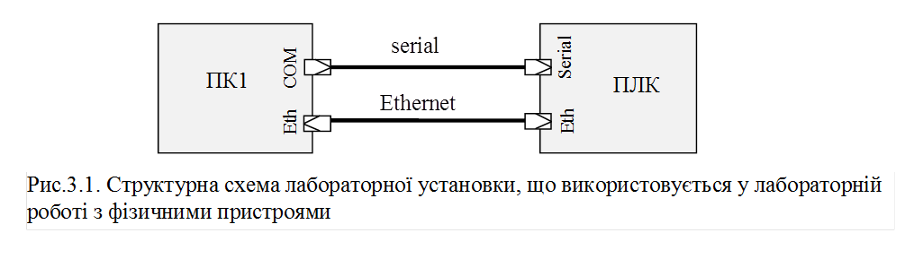

[Лабораторні](README.md)

# ЛАБОРАТОРНА РОБОТА № 3 (Дистанційна форма).

**Основи функціонування MODBUS.** 

**Тривалість**: 1 акад. година.

**Мета:** Ознайомитися з принципами роботи Modbus, отримати навики роботи з пристроями Modbus та діагностичними утилітами Modbus Client/Server.

### Лабораторна установка.

**Мінімально необхідне апаратне забезпечення.** Для проведення віртуальної лабораторної роботи потрібен комп’ютер з характеристиками, наведеними в лабораторній роботі №1.  

**Апаратне забезпечення, матеріали та інструменти для проведення лабораторної роботи з фізичними пристроями (див.рис.3.1).** 

1) Комп’ютер (ПК1) та ПЛК (з підтримкою Modbus RTU Slave та Modbus TCP Server), які з’єднані між собою:

- a.    послідовним  інтерфейсом (RS-232 або RS-485);

- b.   мережею Ethernet;

**Апаратне забезпечення, матеріали та інструменти, що використані у віртуальній лабораторній роботі.** 

Усі досліди проводяться на віртуальній машині.

**Програмне забезпечення для проведення лабораторної роботи з фізичними пристроями.** 

1. Утиліта CAS Modbus Scanner http://www.chipkin.com/products/software/modbus-software/cas-modbus-scanner/

2. Середовище виконання та виконавчий проект для ПЛК, з функціоналом, аналогічним описаному в [додатку 3.3](d3_3.md).

**Програмне забезпечення, що використане у віртуальній лабораторній роботі.** 

1. Утиліта Modbus PLC Simulator http://www.plcsimulator.org/ (необхідно завантажити та встановити на віртуальній машині) 

2. Утиліта CAS Modbus Scanner http://www.chipkin.com/products/software/modbus-software/cas-modbus-scanner/ (вже встановлено на образі віртуальної машини)

3. Віртуальний нуль-модемний емулятор (com0com) http://sourceforge.net/projects/com0com/?source=navbar (вже встановлено на образі віртуальної машини)

4. CoDeSys Control Win http://store.codesys.com/codesys-control-win-sl.html (вже встановлено на образі віртуальної машини)

5. Виконавчий проект CoDeSys  https://drive.google.com/file/d/0B2FfwwwweBSVTm4xTThySm5KSjA/view?usp=sharing (необхідно завантажити і встановити на віртуальну машину)

### Загальна постановка задачі. 

Цілі роботи: 

1) навчитися працювати з програмним утилітами для Modbus;
2) перевірити на практиці принципи роботи Modbus: клієнт-серверну взаємодію, Modbus mapping; 
3) використовуючи Modbus та утиліту Modbus-клієнту керувати та контролювати об’єктом.

 

- [Додаток 1](d3_1.md)
- [Додаток 2](d3_2.md)
- [Додаток 3](d3_3.md)
- [Додаток 4](d3_4.md)

### Послідовність виконання роботи.

1) Ознайомитись з додатками 3.1-3.3.

2) Реалізувати з’єднання між пристроями. 

а) Для реальної установки. Реалізувати з'єднання відповідно до рис.3.1, зробити необхідні налаштування, в тому числі Ethernet, IP-адреси, тощо. 

При з’єднанні пристроїв через порти RS-232, один з них повинен обов’язково бути вимкнений!   

б) Для віртуальної установки. Реалізуйте віртуальне нуль-модемне з’єднання між COM3 та COM4, імітуючи роботу ПОВНОГО нуль-модемного кабелю.

3) Налаштувати Modbus Server (Modbus RTU Slave та Modbus TCP Server).

а) Для реальної установки. З’єднатися середовищем розробки з ПЛК? налаштувати його на наступні параметри:

- адреса пристрою (адреса Modbus RTU Slave) 

`адреса_пристрою = номер_варіанту + 100;`

- бітова швидкість: 19200 для парного варіанту, 9600 - для непарного;

- паритет: парна - для парного варіанту, непарна - для непарного;

Для усіх вікон налаштувань зробити копії екрану для звіту.    

б) Для віртуальної установки. Завантажити з сайту розробника на віртуальну машину Modbus PLC Simulator ([див. Д.3.1](d3_1.md)). Запустити на виконання. Налаштувати наступні параметри Modbus RTU: 

- вибрана активна адреса веденого пристрою (номер Slave) розраховується за формулою:

`адреса_пристрою = номер_варіанту + 100;`

- деактивувати в Modbus PLC Simulator п’ять адрес до і після розрахованої адреси пристрою;

- виставити максимальну кількість змінних для кожного типу рівною 200 + *номер_варіанту*

- налаштувати комунікацію на СОМ3

- з’єднатися з портом

Для усіх вікон налаштувань зробити копії екрану для звіту.    

4) Налаштувати з’єднання Modbus Client

Запустити на виконання CAS Modbus Scanner. Налаштувати задачі на два з’єднання:

- з пристроєм Modbus RTU Slave, налаштованим в п.3; 

- з Modbus TCP Slave, відповідно:

- до його IP адреси (для реальної установки);

- з IP=127.0.0.1 , Port=502 (для віртуальної установки)   

Зробити копію екранів налаштувань;

5) Зчитування Holding Registers.

У CAS Modbus Scanner добавте запит на читання 5-ти Holding Registers починаючи *з номер_варіанту* для Modbus RTU.

Змініть у Modbus Server значення цих 5-ти змінних на довільні але різні значення. Запустіть на виконання задачу. Зробіть копії екранів.  

6) Читання Input Registers, Coils, Input Bits

Пункт 5 повторіть для Input Registers, Coils, Input Bits.

7) Читання по Modbus TCP.

Пункти 5 та 6 повторіть для Modbus TCP.

8) Одиничний та груповий запис.

У CAS Modbus Scanner для Modbus RTU добавте один груповий запит на запис 5-ти Holding Registers, починаючи *з номер_варіанту,* та один запит на запис одного Coils. Перевірте як вони працюють. Дискретні значення переведіть в логічну 1. Зробіть копії екранів.   

9) Запуск ПЛК.

Для віртуальної установки. Закрийте програму Modbus PLC Simulator. Завантажте файли середовища виконання для віртуальної лабораторної установки ([див. додаток 3.3](d3_3.md)) та установіть їх на віртуальну машину. Запустіть віртуальний контролер на виконання, введіть свій варіант, впевніться що Ви вірно ввели варіант та перезапустіть контролер.  

10) Керування об’єктом.

Використовуючи CAS Modbus Scanner та зв'язок Modbus RTU добийтесь того, щоб:

- рівень в баці досягнув значення рівним: `номер_варіанту*100 + 1000;`

- клапан був відкритий на значення: `5000 + номер_варіанту`;

- температура в баці досягнула усталеного значення (не змінювалася)*;* 

Після досягнення необхідних вимог зробити копії екранів віртуальної установки та основного вікна CAS Modbus Scanner. Значення усіх змінних запишіть в таблицю в 16-ковому та десятковому вигляді. Поясніть яким чином визначається значення температури. 

### Оформлення звіту.

Після закінчення роботи, відправте звіт у форматі DOC чи PDF, оформлений у вигляді, наведеному в [додатку 3.4](d3_4.md).

### Перевірка виконання роботи та питання до захисту.

Викладачем перевіряється виконання всіх пунктів роботи відповідно до занотованих у звіті результатів. Оцінюється повнота результатів. Кінцева оцінка коригується по усному опитуванню при очному спілкуванню. Кожен результат студент повинен пояснити. У випадку виникнення помилок або запитань щодо проведення певного пункту, його необхідно буде повторити. 

 