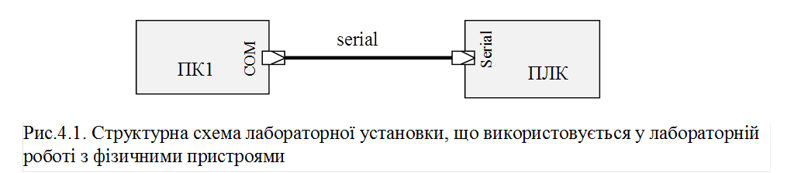
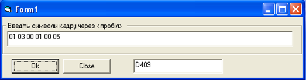

[Лабораторні](README.md)

# ЛАБОРАТОРНА РОБОТА № 4 (Дистанційна форма).

**Основи функціонування MODBUS RTU.** 

**Тривалість**: 1 акад. година.

**Мета:** Ознайомитися з принципами роботи Modbus RTU, отримати навики побудови та розшифрування кадрів Modbus RTU. 

### Лабораторна установка.

**Мінімально необхідне апаратне забезпечення.** Для проведення віртуальної лабораторної роботи потрібен комп’ютер з характеристиками, наведеними в лабораторній роботі №1.  

**Апаратне забезпечення, матеріали та інструменти для проведення лабораторної роботи з фізичними пристроями (див.рис.4.1).** 

a.  Комп’ютер (ПК1) та ПЛК з підтримкою Modbus RTU Slave, які з’єднані між собою послідовним  інтерфейсом (RS-232 або RS-485);

**Апаратне забезпечення, матеріали та інструменти, що використані у віртуальній лабораторній роботі.** 

Усі досліди проводяться на віртуальній машині. 

**Програмне забезпечення для проведення лабораторної роботи з фізичними пристроями.** 

1. Утиліта для роботи з СОМ-портом "COM Port Toolkit V4.0" http://www.compt.ru/ru/download.php (або аналогічна)  

2. Середовище виконання для ПЛК, з функціоналом, аналогічним описаному в додатку 3.3 (з лабораторної роботи 3).

3. Утиліта для розрахунку контрольної суми CRC16 https://drive.google.com/file/d/0B2FfwwwweBSVSkJ6SjhXeVpPaGc/view?usp=sharing (або аналогічна)

**Програмне забезпечення, що використане у віртуальній лабораторній роботі.** 

1. Утиліта для роботи з СОМ-портом "COM Port Toolkit V4.0" http://www.compt.ru/ru/download.php (або аналогічна)

2. Віртуальний нуль-модемний емулятор (com0com) http://sourceforge.net/projects/com0com/?source=navbar (вже встановлено на образі віртуальної машини)

3. CoDeSys Control Win http://store.codesys.com/codesys-control-win-sl.html (вже встановлено на образі віртуальної машини)

4. Виконавчий проект CoDeSys  https://drive.google.com/file/d/0B2FfwwwweBSVTm4xTThySm5KSjA/view?usp=sharing (встановлений на віртуальній машині в лабораторній роботі №3)

5. Утиліта для розрахунку контрольної суми CRC16 https://drive.google.com/file/d/0B2FfwwwweBSVSkJ6SjhXeVpPaGc/view?usp=sharing (встановлений на віртуальній машині в лабораторній роботі)

### Загальна постановка задачі. 

Цілі роботи: 

1) навчитися формувати та розшифровувати кадри Modbus RTU;

2) використовуючи Modbus та утиліту роботи з СОМ-потром керувати та контролювати об’єктом. 

### Послідовність виконання роботи.

1) **Ознайомитись з додатком 4.1, підготовити** **CRCDLL** **до роботи.**

2) **Реалізувати з’єднання між пристроями.** 

а) Для реальної установки. Реалізувати з'єднання відповідно до рис.4.1, зробити необхідні налаштування. 

**При з’єднанні пристроїв через порти** **RS****-232, один з них повинен обов’язково бути вимкнений!**   

б) Для віртуальної установки. Реалізуйте віртуальне нуль-модемне з’єднання між COM3 та COM4, імітуючи роботу ПОВНОГО нуль-модемного кабелю.

3) **Запуск ПЛК.**

Для віртуальної установки. Завантажте файли середовища виконання для віртуальної лабораторної установки (див. додаток 3.3) та установіть їх на віртуальну машину, **якщо це не було зроблено до тепер**. Запустіть віртуальний контролер на виконання, за необхідності введіть свій варіант, впевніться що він введений вірно. 

4) **Побудова кадру на читання** **Holding** **Registers.**

Побудуйте кадр на читання п’яти Holding Registers починаючи з того, який відповідає за клапани для вашого варіанту. Розрахуйте CRC. Кадр занотуйте згідно формату визначеного в додатку 4.2

5) **Відправка кадру на читання** **Holding** **Registers на контролер.**

Завантажте Com Port Toolkit. 

Відправте послідовність байт кадру на віртуальний/реальний контролер через СОМ-порт. Дочекайтеся позитивної відповіді (десь біля секунди). 

Якщо відповідь не прийшла - повторіть пункти 2-5 з перевіркою усіх кроків.   

Якщо відповідь прийшла - перевірте на правильність відповідь, проаналізувавши перші два байти кадру. Якщо відповідь позитивна - перейдіть на п.6, якщо негативна (є помилка обробки функції) – повторіть пункти 4-5 уважніше. 

6) **Розшифрування кадру** 

Розшифруйте кадр і оформіть його, як описано в додатку 4.2. Значення усіх 5-ти значень змінних дайте в десятковому форматі. 

Порахуйте CRC використавши для цього всі прийняті байти (окрім CRC), перевірте чи розрахована контрольна сума співпадає з отриманою. Зробіть копію екрану.  

7) **Зміна поля** **CRC**

Відправте кадр, створений в п.4, але довільно змінивши один з байтів CRC. Результат і його пояснення запишіть в звіті. 

8) **Зміна в запиті адреси** **Holding Registers**

Побудуйте кадр на читання п’яти Input Registers починаючи з (1001-го), тобто 41001. Розрахуйте CRC. Кадр-запит занотуйте згідно формату визначеного в додатку 4.2. 

Відправте кадр до контролеру, дочекайтеся відповіді. Формат кадру-відповіді занотуйте згідно формату визначеного в додатку 4.2. Зробіть пояснення причини отримання такого кадру. 

9) **Формування всіх необхідних кадрів запитів**

Сформуйте кадри-запити на :

-     читання п’яти Input Registers починаючи з того, який відповідає за значення сигналізаторів рівня

-     запис значення клапану *5000 + номер_варіанту*;

-     запис значення Holding Registers для відкриття клапану набору і закриття клапану зливу

-     запис значення Holding Registers для закриття клапану набору і відкриття клапану зливу

-     запис значення Holding Registers для закриття клапану набору і закриття клапану зливу

Запишіть ці запити в табличному вигляді згідно формату визначеного в додатку 4.2. 

10) **Керування установкою** 

Використовуючи Com Port Toolkit та зв'язок Modbus RTU, відправляючи необхідні запити, сформовані в пункті 9 добийтесь того, щоб:

- рівень в баці досягнув значення рівним: `номер_варіанту*100+1000;`

- температура в баці досягнула усталеного значення (не змінювалася); 

Після досягнення необхідних вимог зробити копії екранів віртуальної установки. За допомогою запиту читання Input Registers прочитати значення датчиків та оформити кадр-відповідь відповідно до додатку 4.2. Усі числові значення в поясненні подати в десятковому вигляді. Значення температури розрахуйте он-лайн калькулятором http://www.binaryconvert.com/ або подібними (наведіть копію екрану розрахунку на калькуляторі) 

### Оформлення звіту.

Після закінчення роботи, відправте звіт у форматі DOC чи PDF, оформлений у вигляді, наведеному в додатку 4.2.

### Перевірка виконання роботи та питання до захисту.

Викладачем перевіряється виконання всіх пунктів роботи відповідно до занотованих у звіті результатів. Оцінюється повнота результатів. Кінцева оцінка коригується по усному опитуванню при очному спілкуванню. Кожен результат студент повинен пояснити. У випадку виникнення помилок або запитань щодо проведення певного пункту, його необхідно буде повторити.  

## Додаток 4.1. Утиліта розрахунку контрольної суми CRC16.

#### Д.4.1.1. Призначення.    

 Утиліта ***CRCDLL***  — проста програмка для розрахунку контрольної суми за алгоритмом CRC16, написана на кафедрі ІАСУ НУХТ спеціально для дисципліни промислові мережі та інтеграційні технології. На віртуальній машині підготовленій для курсу вона знаходиться в "C:\CRCdll\crcdll.exe". Завантажити її можна за посиланням https://drive.google.com/file/d/0B2FfwwwweBSVSkJ6SjhXeVpPaGc/view?usp=sharing

**Перед використанням програми прочитайте "Readme.txt" та виконайте настанови!**

#### Д.4.1.2. Опис роботи з утилітою 

Загальний вигляд програми показаний на рис.Д4.1. 

У полі вводу через "пробіл" вводяться байти кадру в 16-ковому форматі. На прикладі показані байти кадру для читання з Modbus Slave п’яти Holding Registers, починаючи з 2-го (40002, але в кадрі вказується починаючи з 0, тобто 1). Після вводу байтів та натисканні "Ок" виводиться контрольна сума.

**Увага! Якщо контрольна сума виводиться в 3-значному вигляді, з правого боку треб доповнити нулем до 4-значного.**  

  

Рис.Д4.1

Отриману контрольну суму можна скопіювати в буфер.  

## Додаток 4.2. Оформлення звіту.

#### Пункт 4. Побудова кадру на читання Holding Registers . 

Байти кадру-запиту вписати в таблицю наступного формату:

| **байти** | **Значення**  **HEX** | **Пояснення** |
| --------- | --------------------- | ------------- |
| 1         |                       |               |
| 2         |                       |               |
| 3         |                       |               |
| …         |                       |               |
| n         |                       |               |

Наприклад.

| **байти** | **Значення**  **HEX** | **Пояснення**                             |
| --------- | --------------------- | ----------------------------------------- |
| 1         | 01                    | Адреса веденого (Slave) – згідно варіанту |
| 2         | 03                    | функція – читання Holding Registers       |
| 3         | 00                    | початкова адреса (HI) = з 40001           |
| 4         | 00                    | початкова адреса (LO)                     |
| 5         | 00                    | кількість (HI) = 3 шт                     |
| 6         | 03                    | кількість (LO)                            |
| 7         | 05                    | CRC (HI)                                  |
| 8         | CB                    | CRC (LO)                                  |

#### Пункт 6. Розшифрування кадру.

Байти кадру-відповіді вписати в таблицю наступного формату:

| **байти** | **Значення**  **HEX** | **Пояснення** |
| --------- | --------------------- | ------------- |
| 1         |                       |               |
| 2         |                       |               |
| 3         |                       |               |
| …         |                       |               |
| n         |                       |               |

Наприклад:

| **байти** | **Значення**  **HEX** | **Пояснення**                             |
| --------- | --------------------- | ----------------------------------------- |
| 1         | 01                    | Адреса веденого (Slave) – згідно варіанту |
| 2         | 03                    | функція – читання Holding Registers       |
| 3         | 06                    | лічильник байт = 6 байт                   |
| 4         | 00                    | значення 40001 (HI) = 10                  |
| 4         | 0A                    | значення 40001 (LO)                       |
| 5         | 00                    | значення 40002 (HI) = 11                  |
| 6         | 0B                    | значення 40002 (LO)                       |
| 5         | 00                    | значення 40003 (HI) = 12                  |
| 6         | 0C                    | значення 40003 (LO)                       |
| 7         | C8                    | CRC (HI)                                  |
| 8         | B3                    | CRC (LO)                                  |

*Навести копію екрану з перевіркою* *CRC*

#### Пункт 7. Зміна поля CRC.

Навести результат досліду і пояснити причини.

#### Пункт 8. Зміна в запиті адреси Holding Registers.

Байти кадру-запиту та відповіді вписати в таблиці наступного формату:

| **байти** | **Значення**  **HEX** | **Пояснення** |
| --------- | --------------------- | ------------- |
| 1         |                       |               |
| 2         |                       |               |
| 3         |                       |               |
| …         |                       |               |
| n         |                       |               |

#### Пункт 9. Формування всіх необхідних кадрів запитів.

| **байти** | **Призначення**                                              | **Кадр запиту (байти у форматі** **HEX через пробіл)** |
| --------- | ------------------------------------------------------------ | ------------------------------------------------------ |
| 1         | читання  п’яти Input Registers  починаючи з *(вказати  номер)* для сигналізаторів рівня |                                                        |
| 2         | запис  значення регістру *(вказати номер)* для *вказати значення* |                                                        |
| 3         | запис  значення Holding Registers *(вказати номер)* для відкриття клапану набору  і закриття клапану зливу |                                                        |
| 4         | запис  значення Holding Registers *(вказати номер)* для закриття клапану набору  і відкриття клапану зливу |                                                        |
| 5         | запис  значення Holding Registers *(вказати номер)* для закриття клапану набору  і закриття клапану зливу |                                                        |

#### Пункт 10. Керування установкою

*Навести копії екранів установки.* 

Байти кадру-відповіді вписати в таблиці наступного формату:

| **байти** | **Значення**  **HEX** | **Пояснення** |
| --------- | --------------------- | ------------- |
| 1         |                       |               |
| 2         |                       |               |
| 3         |                       |               |
| …         |                       |               |
| n         |                       |               |

*Навести копію екрану розрахунку.*

 