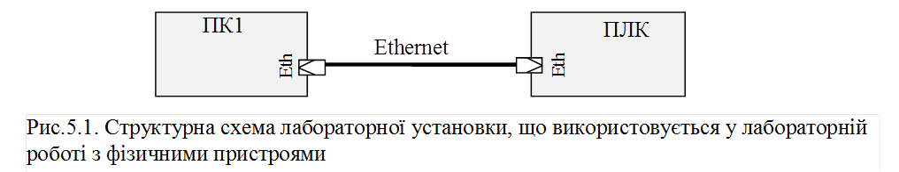
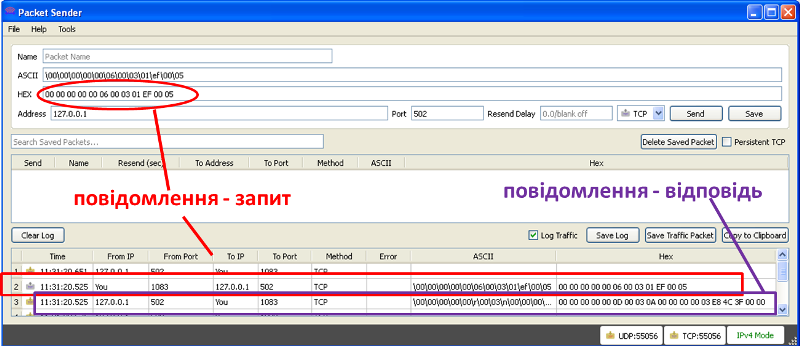

[Лабораторні](README.md)

# ЛАБОРАТОРНА РОБОТА № 5 (Дистанційна форма)

**Основи функціонування MODBUS TCP/IP.** 

**Тривалість**: 1 акад. година.

**Мета:** Ознайомитися з принципами роботи Modbus TCP/IP, отримати навики побудови та розшифрування кадрів Modbus TCP/IP. 

### Лабораторна установка.

**Мінімально необхідне апаратне забезпечення.** Для проведення віртуальної лабораторної роботи потрібен комп’ютер з характеристиками, наведеними в лабораторній роботі №1.  

**Апаратне забезпечення, матеріали та інструменти для проведення лабораторної роботи з фізичними пристроями (див.рис.5.1).** 

a.  Комп’ютер (ПК1) та ПЛК з підтримкою Modbus TCP/IP Server, які з’єднані між собою Ethernet'ом;

**Апаратне забезпечення, матеріали та інструменти, що використані у віртуальній лабораторній роботі.** 

1) Усі досліди проводяться на віртуальній машині. 

**Програмне забезпечення для проведення лабораторної роботи з фізичними пристроями.** 

1) Утиліта Packet Sender для відправки та прийому повідомлень поверх TCP/IP https://packetsender.com (або аналогічна)  

2) Середовище виконання для ПЛК, з функціоналом, аналогічним описаному в додатку 3.3 (з лабораторної роботи 3).

**Програмне забезпечення, що використане у віртуальній лабораторній роботі.** 

1.   Утиліта Packet Sender для відправки та прийому повідомлень поверх TCP/IP https://packetsender.com (необхідно завантажити на віртуальну машину)  

2.   CoDeSys Control Win http://store.codesys.com/codesys-control-win-sl.html (вже встановлено на образі віртуальної машини)

3.   Виконавчий проект CoDeSys  https://drive.google.com/file/d/0B2FfwwwweBSVTm4xTThySm5KSjA/view?usp=sharing (встановлений на віртуальній машині в лабораторній роботі №3) 

### Загальна постановка задачі. 

Цілі роботи: 

1) навчитися формувати та розшифровувати пакети Modbus TCP/IP;

2) використовуючи Modbus TCP/IP та утиліту роботи з TCP-повідомленнями керувати та контролювати об’єктом. 

### Послідовність виконання роботи.

1) **Ознайомитись з додатком 5.1, встановити на віртуальну машину утиліту Packet Sender.**

2) **Реалізувати з’єднання між пристроями.** 

а) Для реальної установки. Реалізувати з'єднання відповідно до рис.5.1, зробити необхідні налаштування. 

б) Для віртуальної установки. IP-з’єднання буде проводитися через спеціальну адресу 127.0.0.1 (localhost), яка посилається на той же вузол. Іншими словами обмін IP-пакетами буде проходити в межах віртуальної машини.

3) **Запуск ПЛК.**

Для віртуальної установки. Завантажте файли середовища виконання для віртуальної лабораторної установки (див. додаток 3.3) та установіть їх на віртуальну машину, **якщо це не було зроблено до тепер**. Запустіть віртуальний контролер на виконання, за необхідності введіть свій варіант, впевніться що він введений вірно.  

4) **Побудова** **Modbus** **TCP/****IP повідомлення (****ADU) на читання** **Holding** **Registers.**

Побудуйте Modbus TCP/IP повідомлення (включаючи MBAP Header) на читання п’яти Holding Registers починаючи з того, який відповідає за клапани для вашого варіанту. Повідомлення занотуйте згідно формату визначеного в додатку 5.2

5) **Відправка кадру на читання** **Holding** **Registers на контролер.**

Завантажте Packet Sender. Відправте послідовність байт повідомлення на віртуальний/реальний контролер через 502-й порт TCP. Дочекайтеся позитивної відповіді (десь біля секунди).  

Якщо відповідь не прийшла - повторіть пункти 2-5 з перевіркою усіх кроків.   

Якщо відповідь прийшла - перевірте на правильність відповідь, проаналізувавши перші два байти повідомлення, що йдуть після MBAP Header. Якщо відповідь позитивна - перейдіть на п.6, якщо негативна (є помилка обробки функції) – повторіть пункти 4-5 уважніше. 

6) **Розшифрування повідомлення**

Зробіть копію екрану з журналом Packet Sender.  

Розшифруйте повідомлення і оформіть його, як описано в додатку 5.2. Значення усіх 5-ти значень змінних дайте в десятковому форматі. 

7) **Формування всіх необхідних повідомлень**

Сформуйте повідомлення-запити на :

-     читання п’яти Input Registers починаючи з того, який відповідає за значення сигналізаторів рівня

-     запис значення клапану *5000 + номер_варіанту*;

-     запис значення Holding Registers для відкриття клапану набору і закриття клапану зливу

-     запис значення Holding Registers для закриття клапану набору і відкриття клапану зливу

-     запис значення Holding Registers для закриття клапану набору і закриття клапану зливу

Запишіть ці запити в табличному вигляді згідно формату визначеного в додатку 5.2. 

Використовуючи Packet Sender та зв'язок Modbus TCP/IP, відправляючи сформовані запити, добийтесь того, щоб:

- рівень в баці досягнув значення рівним: *номер_варіанту*100+1000;*

- температура в баці досягнула усталеного значення (не змінювалася); 

Кожну відповідь записуйте у відповідну колонку таблиці визначеної в додатку 5.2.  

### Оформлення звіту.

Після закінчення роботи, відправте звіт у форматі DOC чи PDF, оформлений у вигляді, наведеному в додатку 5.2.

### Перевірка виконання роботи та питання до захисту.

Викладачем перевіряється виконання всіх пунктів роботи відповідно до занотованих у звіті результатів. Оцінюється повнота результатів. Кінцева оцінка коригується по усному опитуванню при очному спілкуванню. Кожен результат студент повинен пояснити. У випадку виникнення помилок або запитань щодо проведення певного пункту, його необхідно буде повторити. 

## Додаток 5.1. Утиліта для відправки/прийому TCP/UDP пакетів .

#### Д.5.1.1. Призначення (https://packetsender.com).     

 Безкоштовна утиліта ***Packet*** ***Sender*** призначена для відправки та прийому повідомлень всередині TCP або UDP пакетів. Повідомлення можна задавати як в символьному вигляді (ASCII) так і у вигляді 16-кових байт-кодів.  Утиліта Packet Sender доступна для різних типів платформ.   

У даній лабораторній роботі Packet Sender використовується для обміну з сервером Modbus TCP, який знаходиться на віртуальному/реальному контролері. На віртуальній машині підготовленій для даної дисципліни, Packet Sender відсутній, тому актуальну версію необхідно завантажити зі сторінки сайту автору (https://packetsender.com/download). Ми рекомендуємо завантажити портативну версію за посиланням   https://github.com/dannagle/PacketSender/releases/download/v4.7/PacketSenderPortable_2016-01-24.zip. Після завантаження, ZIP-файл необхідно розпакувати і перенести на віртуальну машину, наприклад в корінь диску C.  

#### Д.5.1.2. Основи роботи з утилітою (https://packetsender.com/documentation)

Загальний вигляд утиліти показаний на рис.Д5.1. Для відправки пакету на конкретний вузол його адреса IP вказується в поле Address, а TCP порт програми-серверу (у нашому випадку це Modbus TCP/IP Сервер в контролері) вказується в полі Port. Повідомлення може задаватися у вигляді байтової послідовності HEX кодів вказуючи їх в полі HEX через пробіл. Для відправки повідомлення запиту необхідно натиснути кнопку "Send". 

Усі відправлені та прийняті повідомлення відображаються в журналі повідомлень. На рисунку Д.5.1 червоним кольором показане відправлене повідомлення-запит (поле FromIP=You), а фіолетовим - прийняте повідомлення-відповідь (поле FromIP=127.0.0.1). Для очистки журналу повідомлень необхідно натиснути "Clear Log"      

Рис.Д5.1

## Додаток 5.2. Оформлення звіту.

#### Пункт 4. Побудова Modbus TCP/IP повідомлення (ADU) на читання Holding Registers.

Байти повідомлення-запиту вписати в таблицю наступного формату:

| **байти** | **Значення**  **HEX** | **Пояснення** |
| --------- | --------------------- | ------------- |
| 1         |                       |               |
| 2         |                       |               |
| 3         |                       |               |
| …         |                       |               |
| n         |                       |               |

Наприклад.

| **байти** | **Значення**  **HEX** | **Пояснення**                             |
| --------- | --------------------- | ----------------------------------------- |
| 1         | 00                    | ідентифікатор транзакції (HI) = 0         |
| 2         | 00                    | ідентифікатор транзакції (LO)             |
| 3         | 00                    | Protocol ID (HI) = 0                      |
| 4         | 00                    | Protocol ID (LO)                          |
| 5         | 00                    | Length, кількість наступних байт (HI) = 6 |
| 6         | 06                    | Length, кількість наступних байт (LO)     |
| 7         | 00                    | Unit ID = 0                               |
| 8         | 03                    | функція – читання Holding  Registers      |
| 9         | 01                    | початкова адреса (HI) = з 40496           |
| 10        | EF                    | початкова адреса (LO)                     |
| 11        | 00                    | кількість (HI) = 3 шт                     |
| 12        | 03                    | кількість (LO)                            |

#### Пункт 6. Розшифрування повідомлення

*Навести копію екрану Packet Sender з отриманим повідомленням*

Байти кадру-відповіді вписати в таблицю наступного формату:

| **байти** | **Значення**  **HEX** | **Пояснення** |
| --------- | --------------------- | ------------- |
| 1         |                       |               |
| 2         |                       |               |
| 3         |                       |               |
| …         |                       |               |
| n         |                       |               |

Наприклад:

| **байти** | **Значення**  **HEX** | **Пояснення**                              |
| --------- | --------------------- | ------------------------------------------ |
| 1         | 00                    | ідентифікатор транзакції (HI) = 0          |
| 2         | 00                    | ідентифікатор транзакції (LO)              |
| 3         | 00                    | Protocol ID (HI) = 0                       |
| 4         | 00                    | Protocol ID (LO)                           |
| 5         | 00                    | Length, кількість наступних байт (HI) = 13 |
| 6         | 0D                    | Length, кількість наступних байт (LO)      |
| 7         | 00                    | Unit ID = 0                                |
| 8         | 03                    | функція – читання Holding  Registers       |
| 9         | 0A                    | лічильник байт = 10                        |
| 10        | 00                    | Значення регістру 40496 (HI) = 0           |
| 11        | 00                    | Значення регістру 40496 (LO)               |
| 12        | 00                    | Значення регістру 40497 (HI) = 0           |
| 13        | 00                    | Значення регістру 40497 (LO)               |
| 14        | 03                    | Значення регістру 40498 (HI) = 1000        |
| 15        | E8                    | Значення регістру 40498 (LO)               |
| 16        | 4C                    | Значення регістру 40499 (HI) = 19519       |
| 17        | 3F                    | Значення регістру 40499 (LO)               |
| 18        | 00                    | Значення регістру 40470 (HI) =0            |
| 19        | 00                    | Значення регістру 40470 (LO)               |

#### Пункт 7. Формування всіх необхідних повідомлень запитів, керування установкою та нотування відповідей.

| **байти** | **Призначення**                                              | **Кадр запиту (байти у форматі** **HEX через пробіл)** | **Кадри відповідей (байти у форматі** **HEX через пробіл)** |
| --------- | ------------------------------------------------------------ | ------------------------------------------------------ | ----------------------------------------------------------- |
| 1         | читання  п’яти Input Registers  починаючи з *(вказати  номер)* для сигналізаторів рівня |                                                        |                                                             |
| 2         | запис  значення регістру *(вказати номер)* для *вказати значення* |                                                        |                                                             |
| 3         | запис  значення Holding Registers *(вказати номер)* для відкриття клапану набору  і закриття клапану зливу |                                                        |                                                             |
| 4         | запис  значення Holding Registers *(вказати номер)* для закриття клапану набору  і відкриття клапану зливу |                                                        |                                                             |
| 5         | запис  значення Holding Registers *(вказати номер)* для закриття клапану набору  і закриття клапану зливу |                                                        |                                                             |