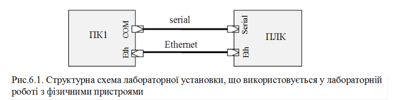

[Лабораторні](README.md)

# ЛАБОРАТОРНА РОБОТА № 6 (Дистанційна форма).

**Використання шини MODBUS RTU та MODBUS TCP/IP для зв’язку SCADA програм з ПЛК.**

**Тривалість**: 1 акад. година.

**Мета:** Отримати навики налаштування в SCADA-програмах підсистеми вводу/виводу для роботи з Modbus RTU та Modbus TCP/IP. 

### Лабораторна установка.

**Мінімально необхідне апаратне забезпечення.** Для проведення віртуальної лабораторної роботи потрібен комп’ютер з характеристиками, наведеними в лабораторній роботі №1.  

**Апаратне забезпечення, матеріали та інструменти для проведення лабораторної роботи з фізичними пристроями (див.рис.5.1).** 

Комп’ютер (ПК1) та ПЛК (з підтримкою Modbus RTU Slave та Modbus TCP Server), які з’єднані між собою:

a.    послідовним  інтерфейсом (RS-232 або RS-485);

b.   мережею Ethernet;

**Апаратне забезпечення, матеріали та інструменти, що використані у віртуальній лабораторній роботі.** 

1. Усі досліди проводяться на віртуальній машині.

 

**Програмне забезпечення для проведення лабораторної роботи з фізичними пристроями.** 

1.   Середовище виконання для ПЛК, з функціоналом, аналогічним описаному в додатку 3.3 (з лабораторної роботи 3).

2.   SCADA програма Vijeo Citect 7.2 (береться на кафедрі або завантажується після реєстрації [http://www.citect.schneider-electric.com/download?gid=231&docname=Vijeo Citect V7.20 Full Version](http://www.citect.schneider-electric.com/download?gid=231&docname=Vijeo Citect V7.20 Full Version)).  

**Програмне забезпечення, що використане у віртуальній лабораторній роботі.** 

1.   CoDeSys Control Win http://store.codesys.com/codesys-control-win-sl.html (вже встановлено на образі віртуальної машини)

2.   Виконавчий проект CoDeSys  https://drive.google.com/file/d/0B2FfwwwweBSVTm4xTThySm5KSjA/view?usp=sharing (встановлений на віртуальній машині в лабораторній роботі №3)

3.   SCADA програма Vijeo Citect 7.2 (вже встановлено на образі віртуальної машини).  

### Загальна постановка задачі. 

Цілі роботи: 

-              розробити проект SCADA для контролю та керування віртуальним об’єктом через Modbus TCP/IP та Modbus RTU. 

### Послідовність виконання роботи.

1.   **Запуск ПЛК.**

Для віртуальної установки. Завантажте файли середовища виконання для віртуальної лабораторної установки (див. додаток 3.3) та установіть їх на віртуальну машину, **якщо це не було зроблено до тепер**. Запустіть віртуальний контролер на виконання, за необхідності введіть свій варіант, впевніться що він введений вірно.  

2.   **Створення проекту та однієї змінної.** 

Користуючись додатком 6.1.1:

-       створіть у Vijeo Citect проект, добавте комунікацію (пристрій вводу/виводу) Modbus RTU для підключення до вашого контролеру;

-       створіть одну змінну, яка посилається на лічильник та перевірте її відображення, адреса змінної визначається наступним чином: 

*адреса_змінної_лічильника = адреса_змінної_клапанів + 3*  

-       за допомогою відомих вам утиліт роботи з COM-портом або Modbus перевірте чи дійсно віртуальний ПЛК не підтримує Coils та Input Bits; зробіть копію екрану де Ви побачили результат перевірки та напишіть висновки щодо цього; 

-       виправте параметр в проекті, як це показано у відео з додатку 6.1.1.

-       добийтеся того, щоб змінна почала відображатися. 

3.   **Створення інших змінних.**

Користуючись додатком 6.1.2:

-       створіть у Vijeo Citect усі інші змінні що мають джерелом даних контролер через зв'язок Modbus RTU;

-       створіть примітивну мнемосхему для проекту

-       виправте параметр в проекті, як це показано у відео з додатку 6.1.2

-       добийтеся того, щоб всі змінні почали відображатися і змінюватися правильно

4.   **Створення змінних** **Modbus** **TCP/****IP.**

Користуючись додатком 6.1.3:

-       створіть у Vijeo Citect комунікацію (пристрій вводу/виводу) Modbus/TCP для підключення до вашого контролеру

-       створіть у Vijeo Citect усі змінні що мають джерелом даних контролер через зв'язок Modbus TCP/IP аналогічно як для Modbus RTU;

-       скопіюйте та модифікуйте мнемосхему для установки як це зроблено в додатку 6.1.3:

-       виправте параметр в проекті, як це показано у відео з додатку 6.1.3

-       добийтеся того, щоб всі змінні почали відображатися і змінюватися правильно

### Оформлення звіту.

Після закінчення роботи, відправте звіт у форматі DOC чи PDF, оформлений у вигляді, наведеному в додатку 5.3 та **файл архіву проекту** **VijeoCitect**.

### Перевірка виконання роботи та питання до захисту.

Викладачем перевіряється виконання всіх пунктів роботи відповідно до занотованих у звіті результатів. Оцінюється повнота результатів. Кінцева оцінка коригується по усному опитуванню при очному спілкуванню. Кожен результат студент повинен пояснити. У випадку виникнення помилок або запитань щодо проведення певного пункту, його необхідно буде повторити.  

## Додаток 6.1. Налаштування комунікацій Modbus RTU та Modbus TCP/IP в SCADA VijeoCitect .

#### Д.6.1.1. Створення проекту, добавлення комунікації Modbus RTU, створення і перевірки однієї числової та одної дискретної змінної

https://youtu.be/Q9i6wyOdU4Q    

#### Д.6.1.2. Створення інших змінних для комунікації Modbus RTU.

https://youtu.be/LoN8jhILdVU

#### Д.6.1.3. Добавлення комунікації Modbus TCP/IP та змінних.

https://youtu.be/IExJdskMHHY

## Додаток 6.2. Оформлення звіту.

#### Пункт 2. Створення проекту та однієї змінної.

*Навести копію екрану на якому видно підтримку або не підтримку контролером Coils та Input Bits.*

Написати висновки щодо підтримки.

**Результат роботи в кінці лабораторної роботи відправляється файлом архіву проекту** **VijeoCitect (резервна копія).** 