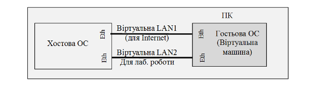

[Лабораторні](README.md)

# ЛАБОРАТОРНА РОБОТА № 7 (Дистанційна форма).

**Основи Ethernet та** **IP.**

**Тривалість**: 1 акад. година.

**Мета:** Познайомитись з протоколами Ethernet та отримати навики налаштування та тестування комунікацій в ОС Windows. 

### Лабораторна установка для проведення лабораторної роботи у віртуальному середовищі.

**Апаратне забезпечення, матеріали та інструменти для проведення віртуальної лабораторної роботи.** 

Усі досліди проводяться на комп’ютері (ПК) на якому встановлена віртуальна машина відповідно до лабораторної роботи №1. Передбачається, що хостова ОС є однією з версій починаючи з Winodws XP. Інші хостові ОС також можуть бути використані, але опис роботи з ними не розглядаються в даній лабораторній роботі. 

Між хостовою та гостьовою ОС до існуючої віртуальної мережі (для Internet) створюється ще одна, яка буде використовуватися в дослідах.

Рис.7.1. Функціональна схема лабораторної установки

**Програмне забезпечення, що використане у віртуальній лабораторній роботі.** 

1. Сніфер Wireshark (http://www.wireshark.org/)
2. Вбудовані утиліти Winodws XP.

### Загальна постановка задачі. 

Цілі роботи: 

-              налаштувати віртуальну локальну мережу між хостовою та гостьовою ОС для проведення наступних лабораторних робіт

-              встановити сніфер Wireshark та отримати навички роботи з ним

-              проаналізувати структуру кадрів Ethernet та ARP-пакетів

- [Додаток 1](d7_1.md)
- [Додаток 2](d7_2.md)
- [Додаток 3](d7_3.md)
- [Додаток 4](d7_4.md)
- [Додаток 5](d7_5.md)

### Послідовність виконання роботи.

1.   **Добавлення мережного адаптеру.**

Користуючись відомостями з [додатку 7.1](d7_1.md) добавте на віртуальну машину додатковий мережний адаптер з властивістю «Під’єднаний до» - «Лише головний адаптер» для створення ще однієї віртуальної мережі між гостьовою та хостовою ОС, яка буде використовуватися в дослідах (рис.7.1). 

2.   **Налаштування адаптерів.**

На гостьовій ОС (у віртуальній машині) перейменуйте назву новоствореного адаптеру відповідно до назви вашого логіну: `NET вашлогін` 

Користуючись відомостями з [додатку 7.2](d7_2.md) налаштуйте драйвери TCP/IP адаптерів в гостьовій (на віртуальній машині) та хостовій ОС наступним чином:

-  IP адаптера хостової ОС:192.168.x.1/24

-  IP адаптера гостьової ОС (віртуальної машини):192.168.x.2/24

Де x – номер варіанту. 

Зробіть копії екранів згідно формату і прикладу зробленого в [додатку 7.5](d7_5.md).

**Надалі в лабораторній роботі всі дії на гостьовій ОС будуть проводитися саме з цим мережним адаптером!**

3.   **Визначення** **MAC-адрес утилітою**  **Getmac.** 

На віртуальній мережі запустіть консольну утиліту ***cmd*** (Пуск->Выполнить). Налаштуйте властивості консольного вікна через контекстне меню утиліти так, щоб ширина розміру вікна була 120 символів. 

На віртуальній машині через консольне вікно запустіть утиліту ***Getmac*** (див. додаток [Д7.4.4](d7_4.md)), та використайте її для перегляду MAC-адрес доступних мережних інтерфейсів. Зробіть копію екрану, та занесіть значення MAC-адрес в таблицю. Повторіть те саме для хостової ОС.

Заповніть таблицю з МАС-адресами мережних плат для новоствореної віртуальної мережі.

4.   **Тест наявності підключення.** 

За допомогою утиліти ***ping*** зробіть тест наявності підключення:

-    адаптера хостової ОС з гостьової

-    адаптера гостьової ОС з хостової

Зробіть копії екранів для звіту. Проаналізуйте результати тестування. За відсутності з’єднання повторіть п.2. 

5.   **Завантаження, інсталяція та налаштування** **Wireshark.** 

Користуючись описом з [додатку 7.3](d7_3.md) Завантажте та встановіть на віртуальну машину сніфер Wireshark. 

Запустіть на виконання сніфер WireShark. Через меню Edit/Preferences/Columns добавте необхідні поля, що показані на рис.7.2, якщо вони відсутні, а всі інші видаліть.

Рис.7.2.

6.   **Робота з кешем ARP.**

Ознайомтесь з додатком [Д.7.4.3](d7_4.md). Видаліть всі записи з кешу ARP віртуальної машини. Виведіть таблицю записів таблиці ARP і перевірте чи є там записи. 

Потім запустіть утиліту ping для тесту з’єднання з мережною картою хостової ОС. Виведіть таблицю записів таблиці ARP. Зробіть копію екрану і поясніть отримані результати (усі поля таблиці ARP). 

7.   **Запуск прослуховування мережі сніфером Wireshark.** 

Налаштуйте інтерфейс Wireshark на мережну карту та запустіть захоплення пакетів. 

Очистіть ARP кеш та перевірте чи він порожній. 

Запустіть утиліту ping для тесту з’єднання адаптера хостової ОС з гостьовою. Після закінчення тесту зупиніть захоплення пакетів. 

Зробіть фільтрацію пакетів по протоколу ARP, тобто щоб відображалися тільки кадри з arp-пакетами. Зробіть копію екрану, та поясніть отримані результати. 

8.   **Аналіз пакету.**

Використовуючи вікно деталізації пакету визначте структуру та призначення пакетів в кадрі, які містять ARP (2 шт). Зокрема для кожного кадру та кожного пакету в ньому згідно ієрархії вкладеності визначити:

-    протокол

-    поля та їх призначення

Зробіть копії екранів з відкритою деталізацією кадрів (2 шт). Під кожною копією екрану занотуйте результати у вигляді таблиці, наведеною в [додатку 7.5](d7_5.md).  

9.   **Аналіз gratuitous ARP.**

На хостовій ОС вимкніть мережний адаптер «VirtualBox Host-Only Ethernet Adapter». На гостьовій ОС (віртуальній машині) запустіть на виконання Wireshark. Включіть захоплення пакетів з мережі. Після цього включіть на хостовій ОС попередньо вимкнений мережний адаптер. Коли індикатор мережі покаже, що вона працює (порядку декілька секунд) зупиніть на гостьовій машині захоплення пакетів.

Використовуючи фільтри та вікно деталізації пакету визначте структуру та призначення пакетів в кадрі, які містять ARP (3 шт). Зокрема для кожного кадру та кожного пакету в ньому згідно ієрархії вкладеності визначити:

-    протокол

-    поля та їх призначення

Зробіть копії екранів з відкритою деталізацією кадрів (3 шт). Під кожною копією екрану занотуйте результати у вигляді таблиці, наведеною в [додатку 7.5](d7_5.md).  

  Поясніть результати.

### Оформлення звіту.

Після закінчення роботи, відправте звіт у форматі DOC чи PDF, оформлений у вигляді, наведеному в [додатку 7.5](d7_5.md).

### Перевірка виконання роботи та питання до захисту.

Викладачем перевіряється виконання всіх пунктів роботи відповідно до занотованих у звіті результатів. Оцінюється повнота результатів. Кінцева оцінка коригується по усному опитуванню при очному спілкуванню. Кожен результат студент повинен пояснити. У випадку виникнення помилок або запитань щодо проведення певного пункту, його необхідно буде повторити. 

