# Фізичний рівень

**Вигадана історія, як ми зі своїм другом свою мережу придумували: "Система на базі батарейок з лампочками"** 

[1.4.Фізичний рівень](http://youtu.be/py98P0jkrW8)

[Презентації](https://drive.google.com/file/d/1qeKF9tgjarSOhVvPgjYOaiQv5lCgS2f4/view?usp=sharing)

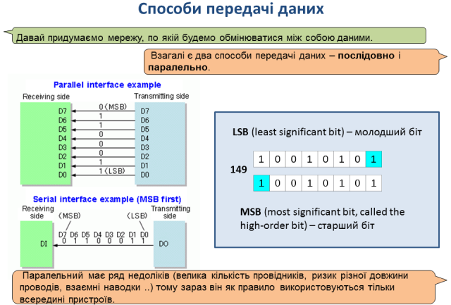

коментар

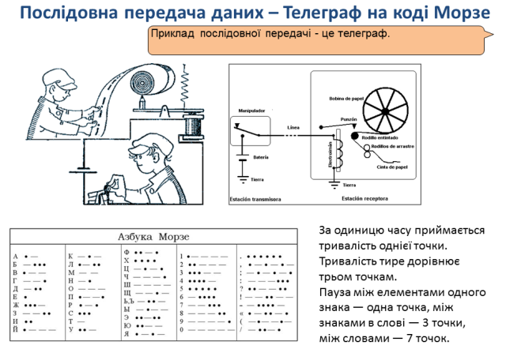

коментар

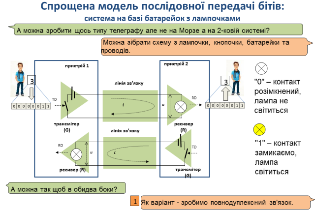

коментар

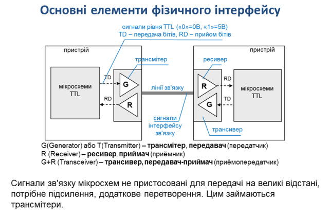

коментар

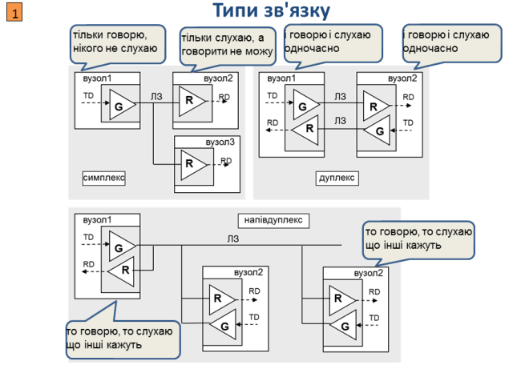

коментар

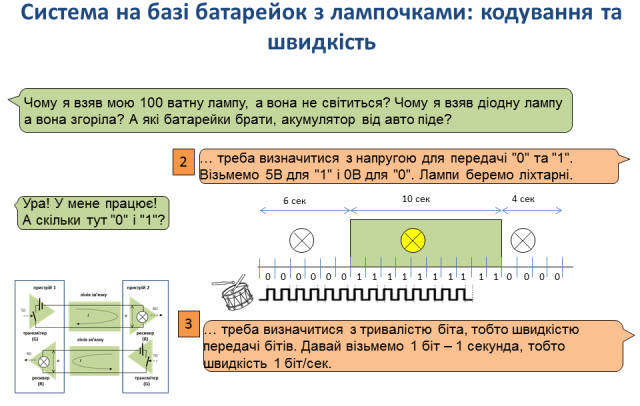

коментар

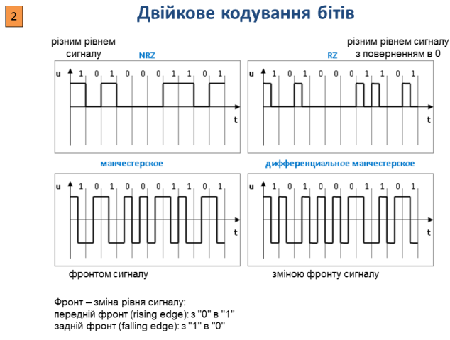

коментар

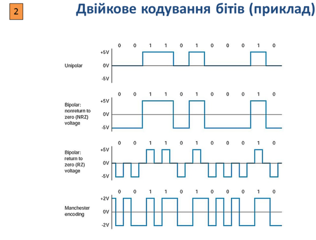

коментар

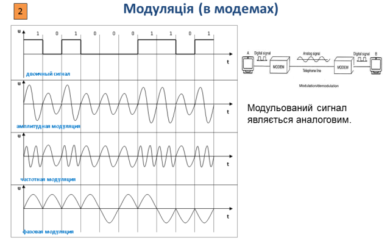

коментар

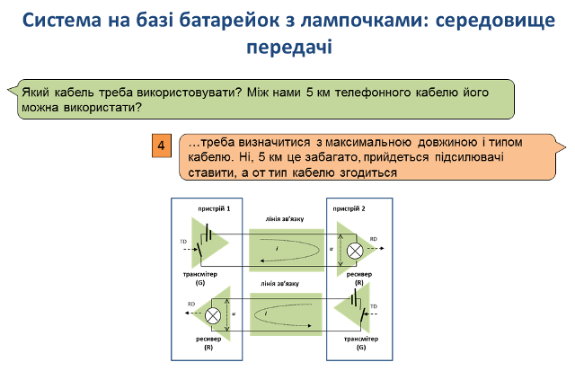

коментар

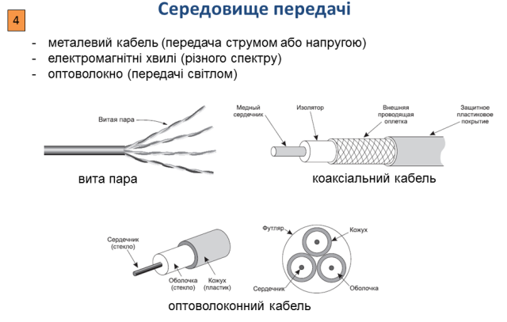

коментар

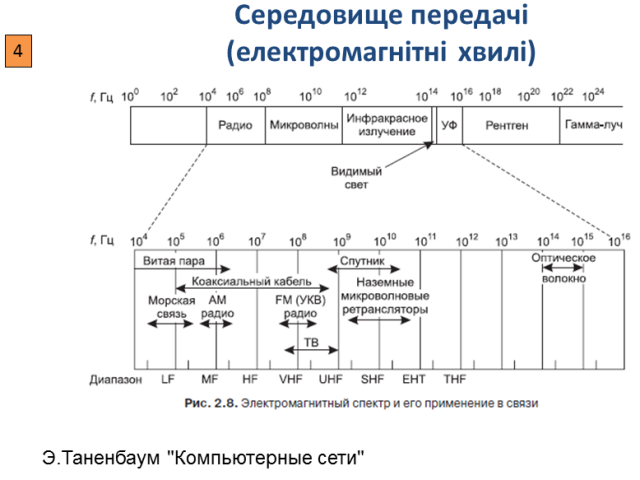

коментар

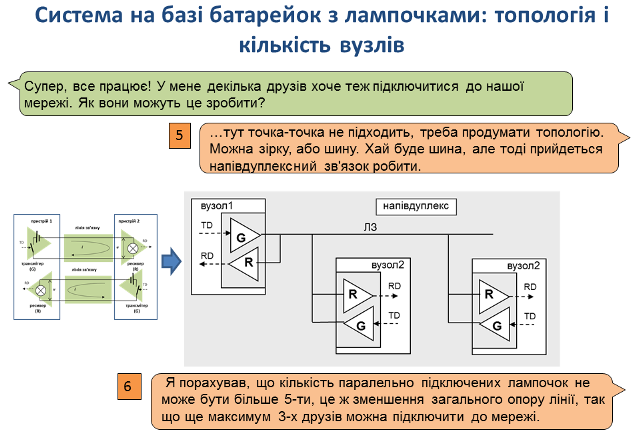

коментар

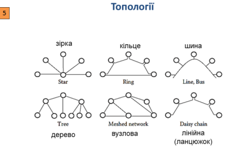

коментар

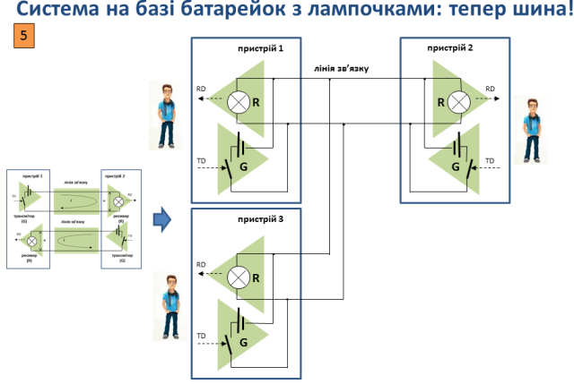

коментар

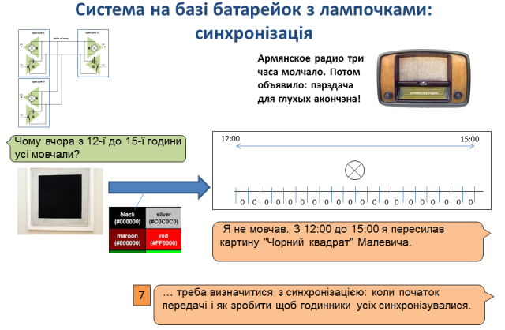

коментар

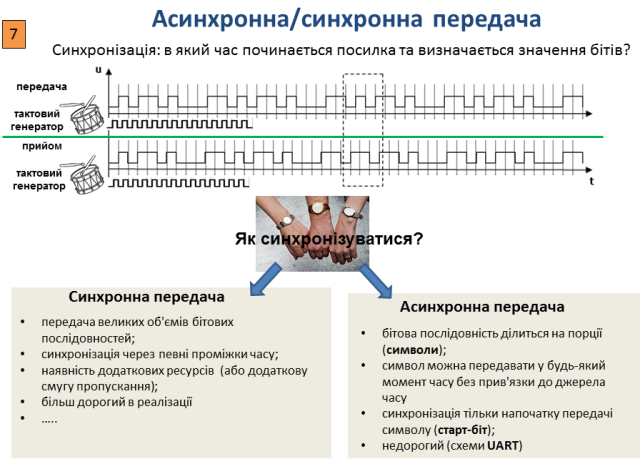

коментар

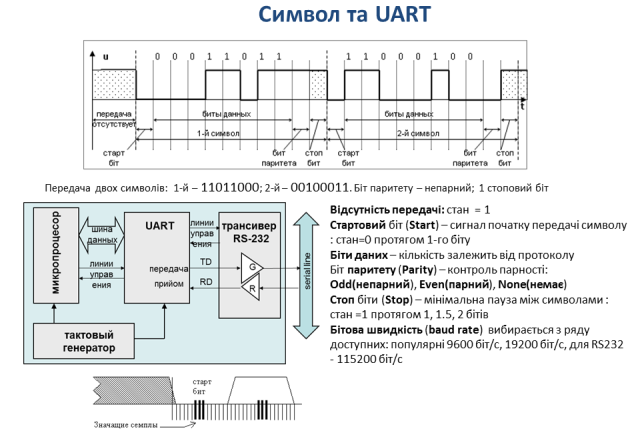

коментар

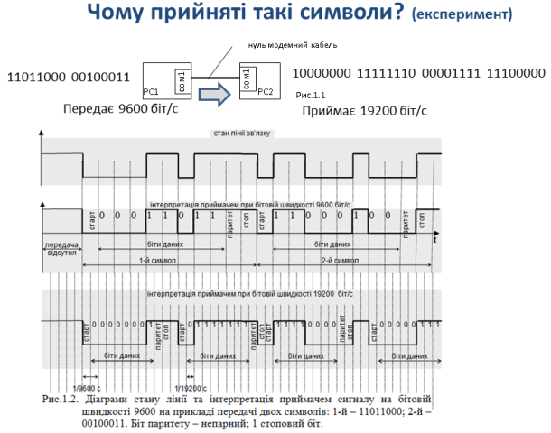

коментар

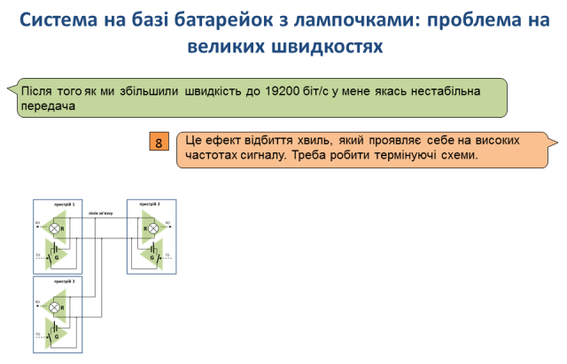

коментар

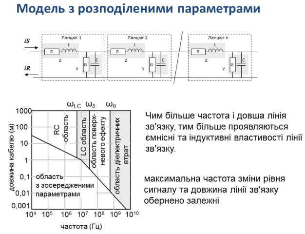

коментар

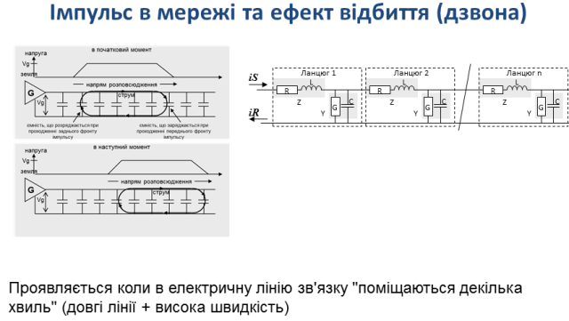

коментар

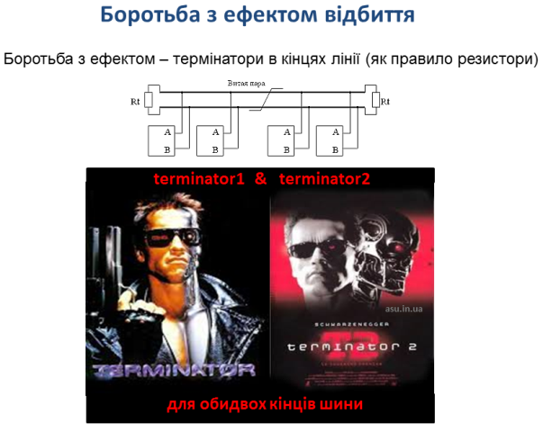

коментар

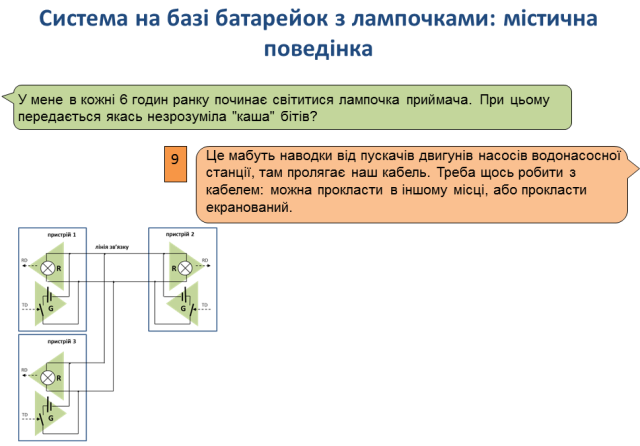

коментар

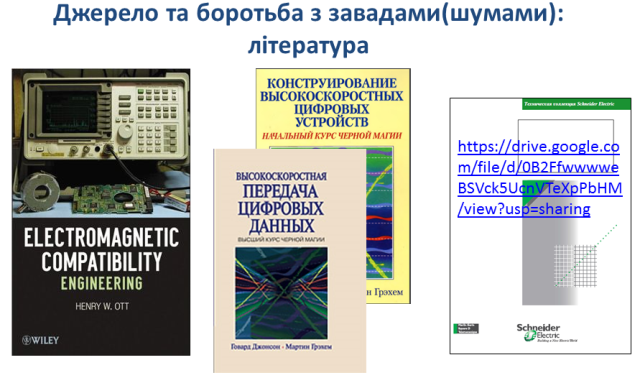

коментар

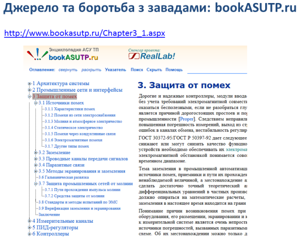

коментар

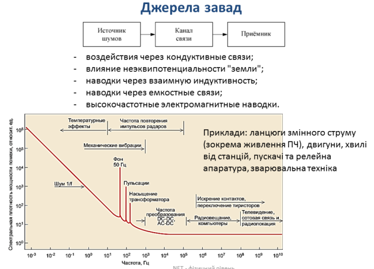

коментар

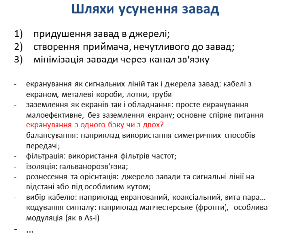

коментар

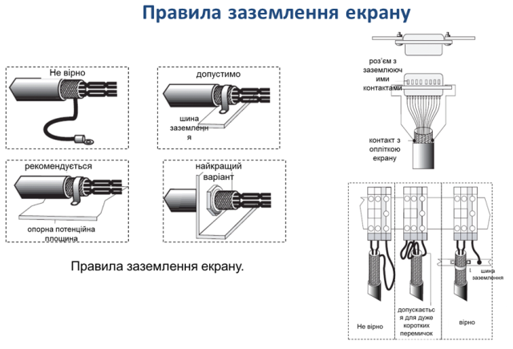

коментар

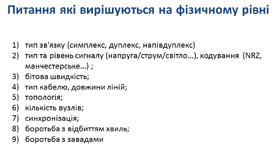

коментар

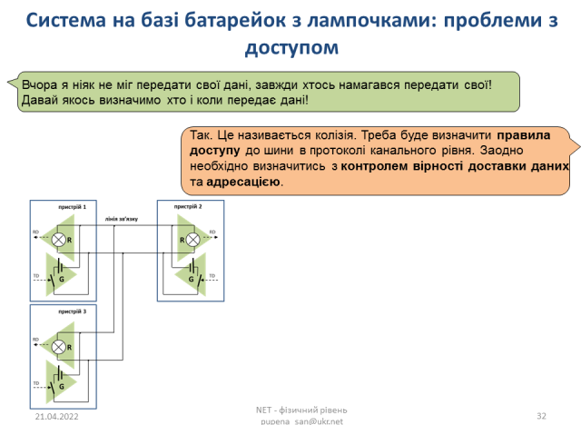

коментар

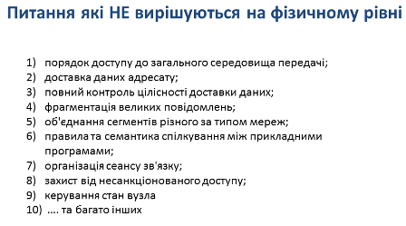

коментар

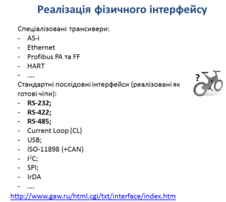

коментар