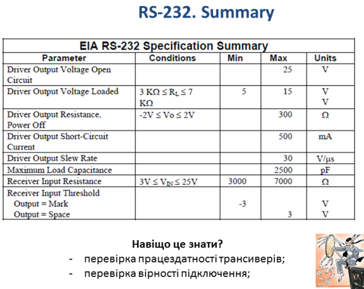

# Стандартні асинхронні послідовні інтерфейси

[2.1.Стандартні асинхронні послідовні інтерфейси](http://youtu.be/QbC0KNzl784)

[Презентації](https://drive.google.com/file/d/1i449itmtzKxBjouE2UG7bUymocvTk66s/view?usp=sharing)

коментар

коментар

коментар

коментар

коментар

коментар

коментар

коментар

коментар

коментар

коментар

коментар

коментар

коментар

коментар

коментар

коментар

коментар

коментар

коментар

коментар

коментар

коментар

коментар

коментар

коментар

коментар

коментар

коментар