# Утиліти для роботи з COM-портами ПК

[2.2.Символьний режим обміну (character mode, ASCII) 2.3. Утиліти для роботи з COM-портами ПК](https://www.youtube.com/watch?v=Cogf0RhaBtw)

[Презентації](https://drive.google.com/file/d/1etug896RiGI8t0NY4m9Oz_wfOjABBpuU/view?usp=sharing)

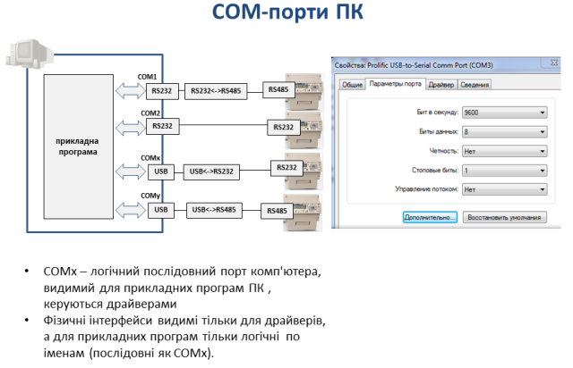

коментар

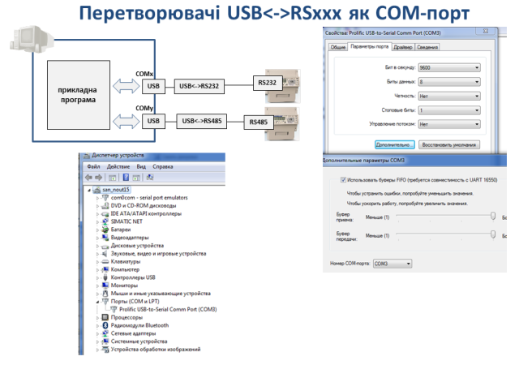

коментар

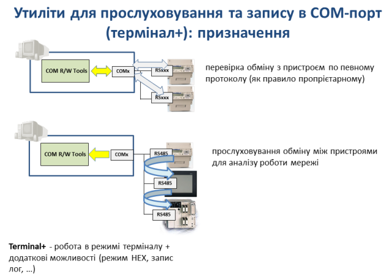

коментар

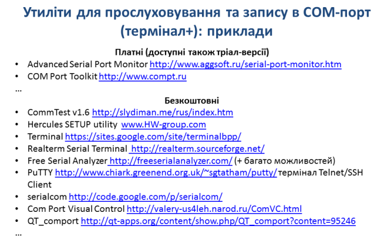

коментар

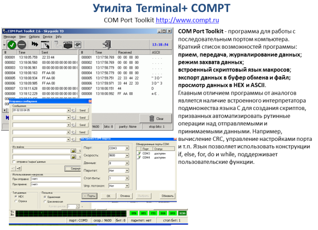

коментар

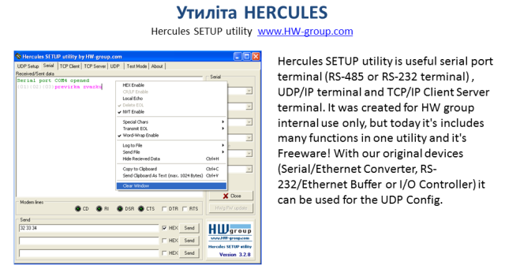

коментар

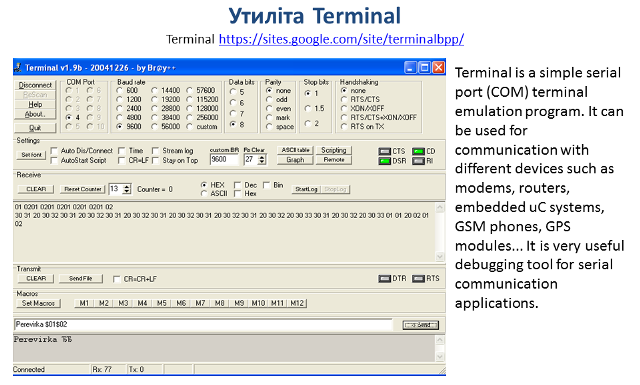

коментар

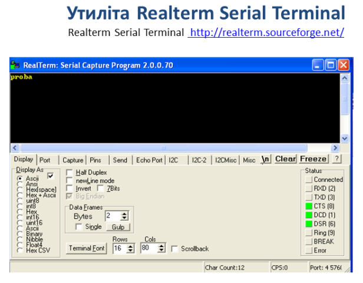

коментар

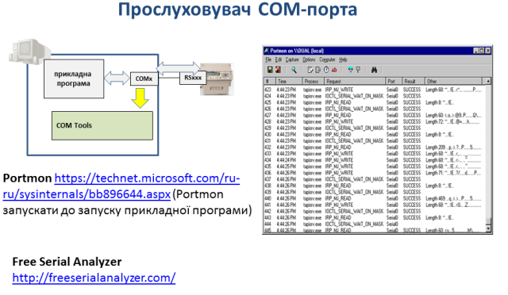

коментар

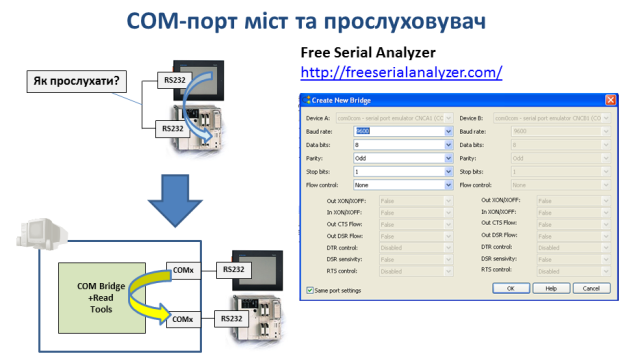

коментар

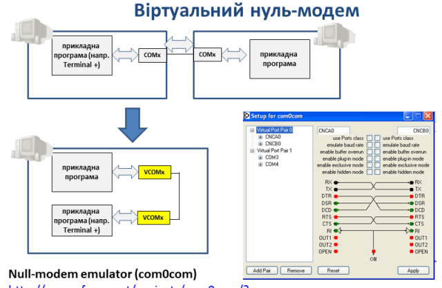

коментар