# MODBUS RTU/ASCII

[3.2.MODBUS RTU/ASCII](http://youtu.be/smUK3CvH8sI)

[Презентації](https://drive.google.com/file/d/1JtsSK77gW5ODrm03JH2miYw455sWnFZu/view?usp=sharing)

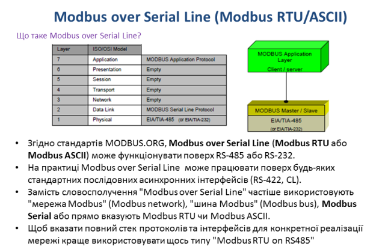

коментар

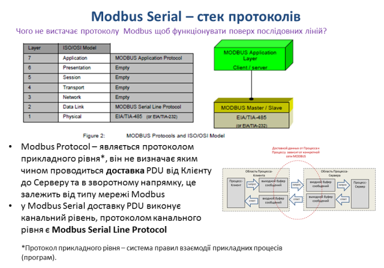

коментар

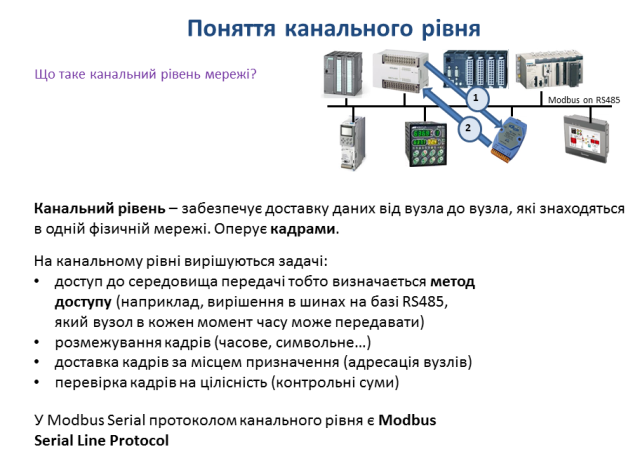

коментар

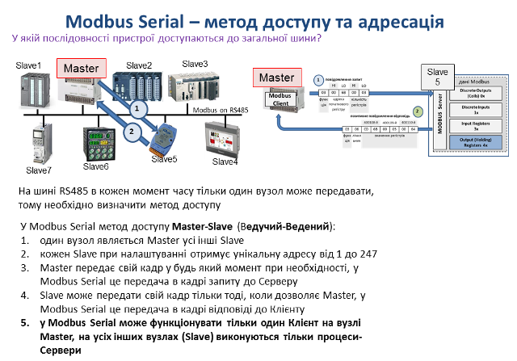

коментар

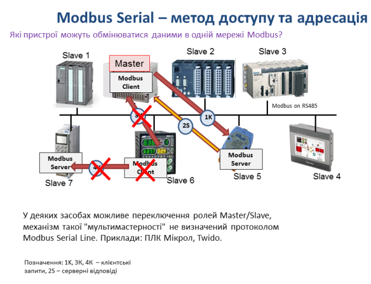

коментар

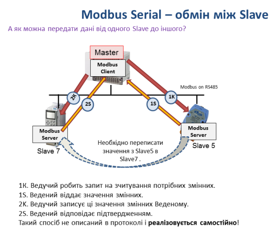

коментар

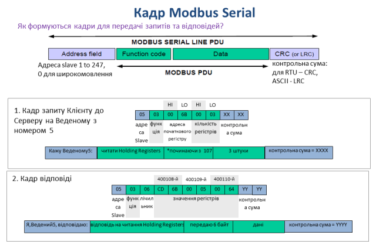

коментар

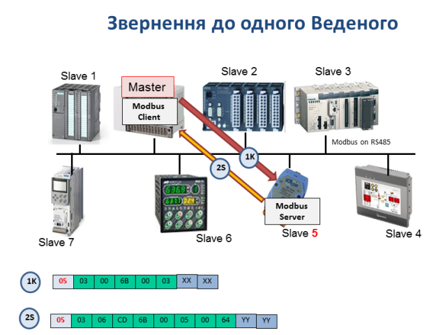

коментар

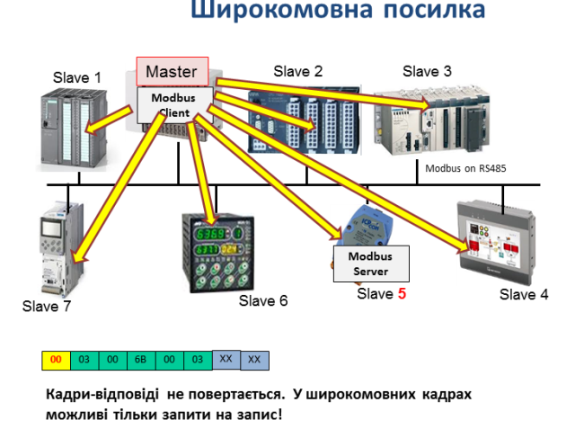

коментар

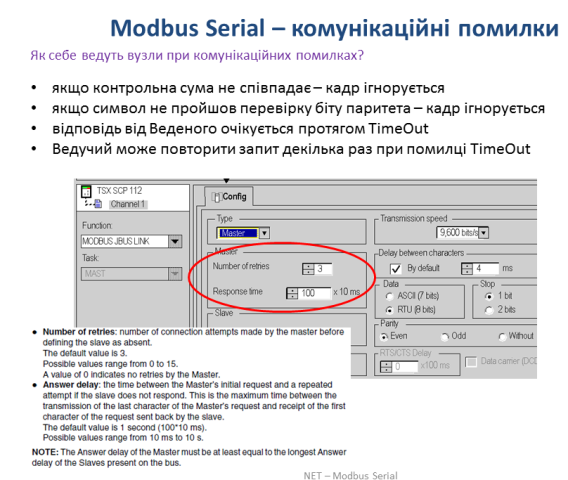

коментар

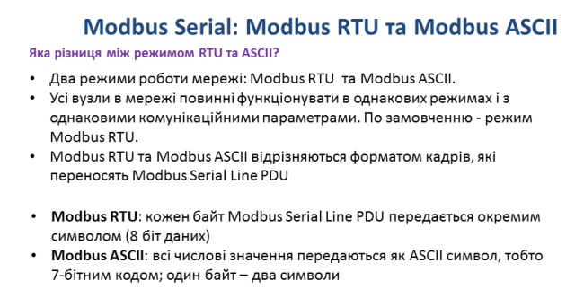

коментар

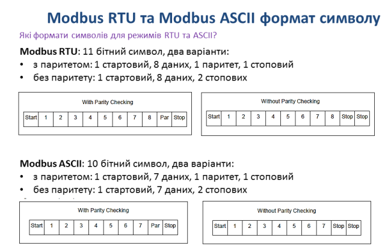

коментар

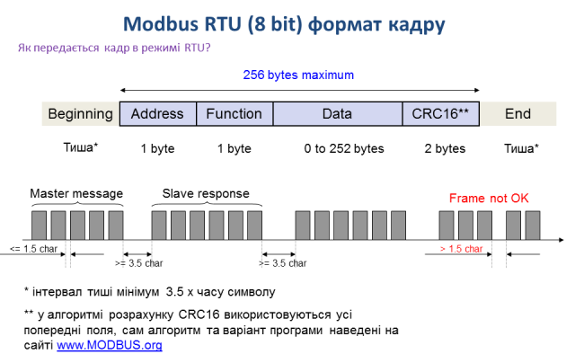

коментар

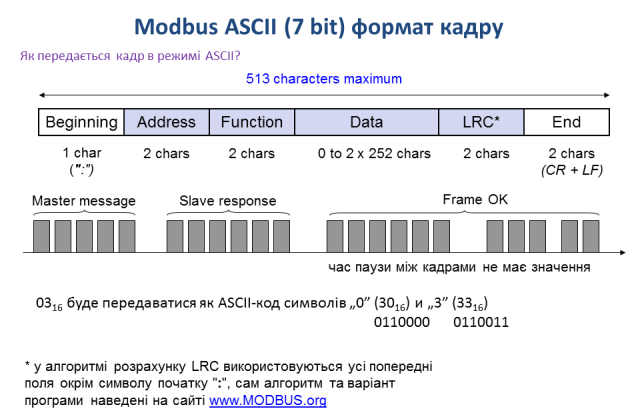

коментар

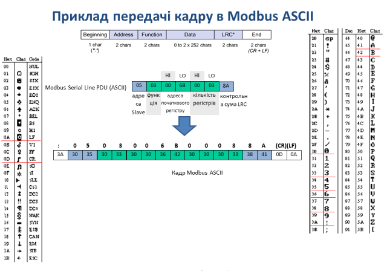

коментар

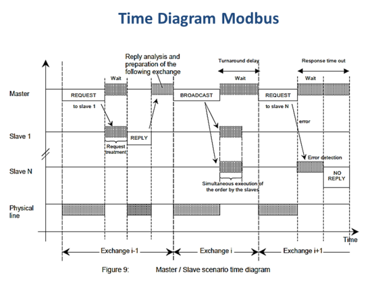

коментар

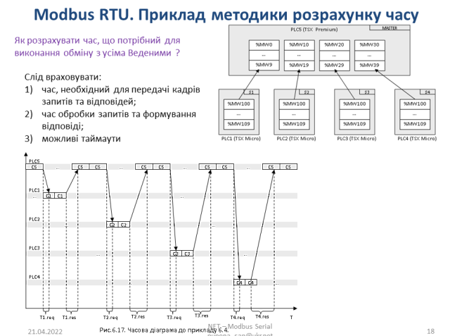

коментар

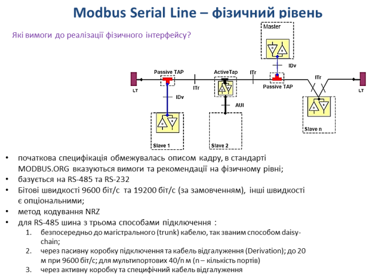

коментар

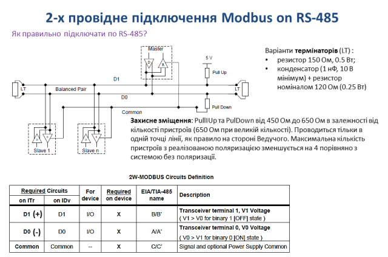

коментар

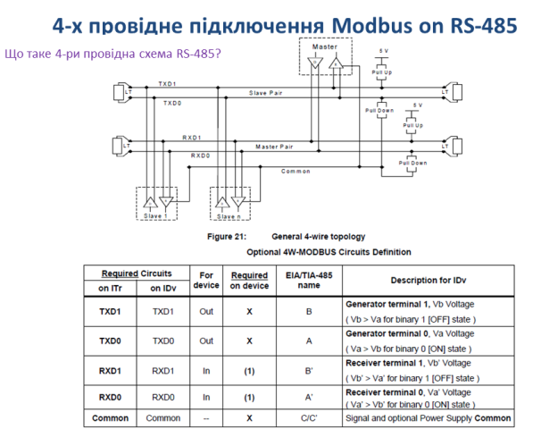

коментар

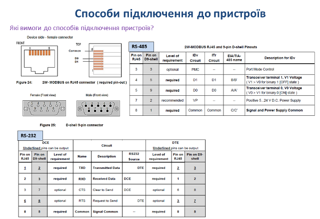

коментар

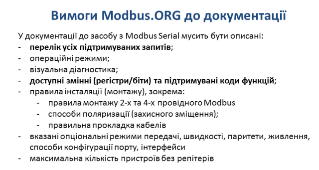

коментар

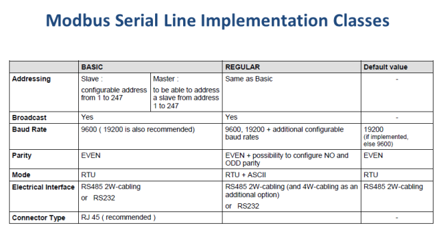

коментар

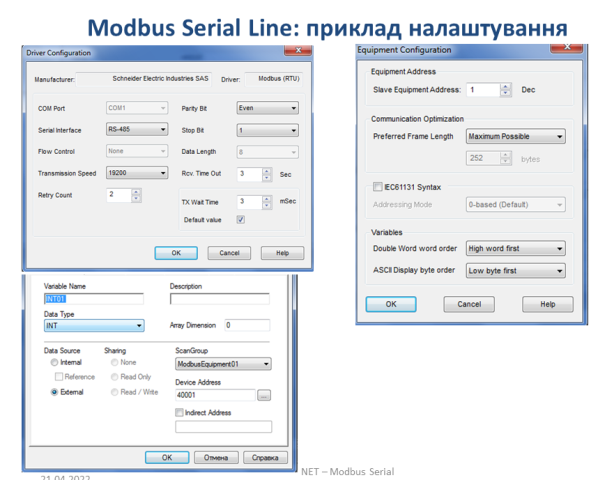

коментар

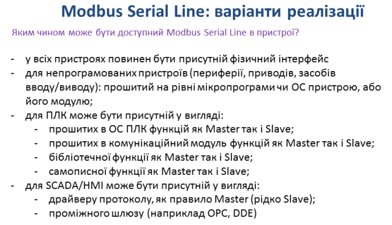

коментар

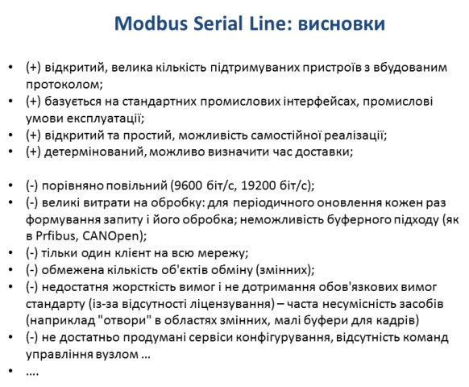

коментар