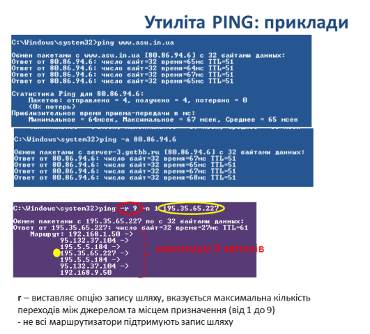

# Протоколи IP (Частина 3)

[4.2.3.Протоколи IP (Частина 3)](https://youtu.be/Oxmzz32s-5I)

[Презентації](https://drive.google.com/file/d/1WUSs1trQL2H4s6sbBqq6GgCV9v7nNR0x/view?usp=sharing)

коментар

коментар

коментар

коментар

коментар

коментар

коментар

коментар

коментар

коментар

коментар

коментар

коментар

коментар

коментар

коментар

коментар

коментар

коментар

коментар